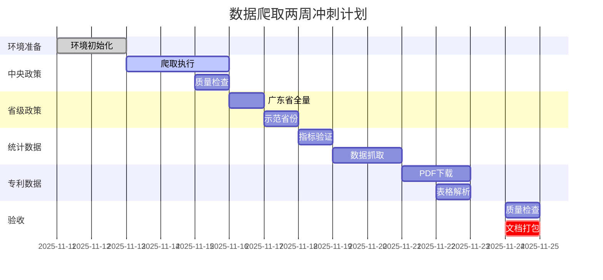

# 01_数据爬取方案

## 文档信息

- **项目名称**: 政策语义因果图谱(PSC-Graph)
- **模块**: 数据采集层
- **版本**: v1.0
- **更新日期**: 2025-11-11
- **负责人**: 数据工程组

---

## 一、概览与目标

### 1.1 业务目标

本方案是PSC-Graph项目的基础数据采集模块,旨在构建**"政策语义→政策意图→产业行为/绩效"**端到端体系的数据底座。数据采集需满足:

- ✅ **完整性**: 覆盖中央/省级政策+产业指标+专利统计
- ✅ **合规性**: 严格遵守robots.txt、QPS≤1.0、来源合法
- ✅ **可追溯性**: 所有数据附官方链接、SHA256校验、时间戳
- ✅ **工程化**: 标准目录结构、配置文件、断点续爬、日志规范

### 1.2 数据源矩阵

| 数据类型 | 来源 | 时间跨度 | 粒度 | 优先级 |
|---------|------|---------|------|--------|
| **政策文本(中央)** | 国务院政策文件库 | 2009-至今 | 文档级 | 🔴 最高 |
| **政策文本(省级)** | 31省市科技厅 | 2009-至今 | 文档级 | 🔴 最高 |
| **产业指标** | 国家统计局门户 | 2009-至今 | 省-年/季/月 | 🟡 高 |
| **专利统计** | CNIPA月报/年报 | 2009-至今 | 省-月/年 | 🟡 高 |

### 1.3 实施路径


**预计时间**: 2周(10个工作日)

---

## 二、数据源详细规范

### 2.1 中央政策层(国务院政策文件库)

#### 📋 基本信息

| 项目 | 内容 |
|-----|------|
| **权威入口** | https://www.gov.cn/zhengce/zhengcewenjianku/ |
| **部门文件** | https://www.gov.cn/zhengce/zhengceku/bmwj/home_{page}.htm |
| **政策解读** | https://www.gov.cn/zhengce/jiedu/home_{page}.htm |
| **Robots** | https://www.gov.cn/robots.txt |
| **时间范围** | 2009年至今(主样本期) |
| **分页模式** | 静态分页 `home_0.htm`, `home_1.htm`... |

#### 📊 字段规范(Schema)

**必须字段**:
```yaml
title:           # 标题 (string)
pub_date:        # 发布日期 (ISO8601, 如"2023-01-15")
issuer:          # 发布机关 (string)
doc_no:          # 文号 (string, 如"国发〔2023〕1号")
index_no:        # 索引号 (string)
category:        # 类别 (enum: "国务院文件"|"部门文件"|"政策解读")
status:          # 时效状态 (enum: "现行"|"废止"|"失效")
source_url:      # 来源URL (string)
html:            # 原文HTML (string, 用于存档)
content_text:    # 正文纯文本 (string, 用于NLP抽取)
sha256:          # 正文哈希 (string, 32字符, 用于去重)
retrieved_at:    # 抓取时间戳 (ISO8601)
region:          # "CN-Central" (中央层标识)
```

**可选字段**:
```yaml
attachments:     # 附件列表 (array)
  - filename:    # 附件文件名
    url:         # 下载链接
    type:        # 文件类型 (pdf|doc|docx)

related:         # 关联文件 (array)
  - title:       # 关联文件标题
    url:         # 关联URL
    relation_type: # 关系类型 (如"政策解读"|"修订")
```

#### 🔑 去重策略

```python
# 主键生成逻辑
primary_key = hash(title + doc_no + pub_date)

# 冲突处理
if doc_no is None:
    primary_key = hash(title + pub_date)

# SHA256校验
sha256_hash = hashlib.sha256(content_text.encode('utf-8')).hexdigest()
# 入库前检查: 如已存在同hash文件,跳过
```

#### 🎯 抓取策略

```yaml
节流控制:
  QPS: ≤1.0 req/s
  随机抖动: +random(0, 0.3)秒
  重试策略: 指数退避,最大5次

合规保证:
  User-Agent: "PSC-Graph/0.1 (+research; contact: policy@psc-graph.org)"
  Robots: 遵守www.gov.cn/robots.txt
  允许路径: /zhengce/*, /home_*.htm
  禁止路径: /2016*/, /premier/...

断点续爬:
  Checkpoint文件: results/checkpoints/gov_central.json
  记录字段: {"name": "...", "next_page": 3, "last_update": "..."}
  恢复逻辑: 启动时读取next_page,从该页继续
```

#### 📝 示例输出

```json
{
  "doc_id": "gov_central_20230115_abc123",
  "title": "国务院关于加快发展人工智能产业的若干意见",
  "pub_date": "2023-01-15",
  "issuer": "国务院",
  "doc_no": "国发〔2023〕1号",
  "index_no": "000014349/2023-00001",
  "category": "国务院文件",
  "status": "现行",
  "source_url": "https://www.gov.cn/zhengce/content/2023-01/15/content_5735001.htm",
  "html": "<html>...</html>",
  "content_text": "为加快发展人工智能产业...",
  "sha256": "a1b2c3d4e5f6...",
  "retrieved_at": "2025-11-11T10:30:00+08:00",
  "region": "CN-Central",
  "attachments": [
    {
      "filename": "附件1.pdf",
      "url": "https://www.gov.cn/.../attachment1.pdf",
      "type": "pdf"
    }
  ]
}
```

---

### 2.2 省级政策层(科技厅/科委)

#### 📋 站点种子清单

**优先批次1(示范样本)**:

| 省份 | 入口URL | Adcode | 备注 |
|-----|---------|--------|------|
| **广东省** | https://gdstc.gd.gov.cn/zwgk_n/zcfg/szcfg/index.html | 44 | 分页清晰,提供全国省级入口 |
| **北京市** | https://kw.beijing.gov.cn/ | 11 | 市科委/中关村管委 |
| **上海市** | https://stcsm.sh.gov.cn/ | 31 | 市科委 |
| **浙江省** | http://kjt.zj.gov.cn/ | 33 | 省科技厅 |
| **江苏省** | http://kxjst.jiangsu.gov.cn/ | 32 | 省科技厅 |
| **深圳市** | http://stic.sz.gov.cn/ | 4403 | 地级市示范 |

**扩展批次2**:
山东、安徽、湖北、四川、重庆、湖南等(从广东页面的"各省市科技管理部门"导航抽取完整清单)

#### 📊 字段规范(继承+新增)

**新增地域字段**:
```yaml
province_name:   # 省份名称 (如"广东省")
adcode_prov:     # 省级行政区划码 (2位, 如"44")
```

**其他字段**: 继承中央层Schema(title, pub_date, issuer等)

#### 🎯 抓取策略

```yaml
栏目定位:
  优先栏目: "政策法规"、"政策文件"、"政策解读"
  备选栏目: "通知公告"、"工作动态"(含政策信息)

分页适配:
  类型1: 静态分页 (如广东: mindex_{page}.html)
  类型2: JS翻页 (需解析nextPage按钮)
  类型3: 无分页 (全部列表页)

附件处理:
  支持格式: PDF, DOC, DOCX
  下载策略: 统一下载到corpus/raw/policy_prov/{省份}/attachments/
  MIME检查: 验证Content-Type与文件扩展名一致

节流控制:
  QPS: ≤0.7 req/s (比中央层更保守)
  随机抖动: +random(0, 0.5)秒
  错误重试: 最大3次
```

#### 📝 配置示例(seeds_sites.yaml)

```yaml
provinces:
  - name: 广东省科技厅
    region: 广东省
    adcode_prov: 44
    list_url: "https://gdstc.gd.gov.cn/zwgk_n/zcfg/szcfg/mindex.html"
    pagination: true
    pagination_selector: "a:contains('下一页')"
    detail_link_selector: "a"

  - name: 北京市科委/中关村管委
    region: 北京市
    adcode_prov: 11
    homepage: "https://kw.beijing.gov.cn/"
    # 需二次分析页面结构后补充
```

---

### 2.3 产业/宏观指标(国家统计局)

#### 📋 基本信息

| 项目 | 内容 |
|-----|------|
| **数据门户** | https://data.stats.gov.cn/easyquery.htm |
| **接口类型** | 前端公开JSON接口 |
| **编制规则** | https://www.stats.gov.cn/sj/tjbz/gjtjbz/202302/t20230213_1902741.html |
| **时间范围** | 2009年至今 |
| **更新频率** | 月度/季度/年度(按指标类型) |

#### 📊 核心指标清单

**必须采集指标**:

| 指标类别 | 指标名称 | 编码示例 | 频率 | 粒度 |
|---------|---------|---------|------|------|
| **GDP** | 地区生产总值(现价) | A0101 | 年度 | 省级 |
| **GDP** | 地区生产总值(不变价) | A0102 | 年度 | 省级 |
| **GDP** | 地区生产总值(季度) | A0103 | 季度 | 省级 |
| **R&D** | R&D经费支出 | A0RD01 | 年度 | 省级 |
| **R&D** | R&D强度(R&D/GDP) | A0RD02 | 年度 | 省级 |
| **工业** | 规模以上工业增加值 | A0401 | 月度/年度 | 省级 |
| **工业** | 高技术制造业增加值 | A0402 | 年度 | 省级 |
| **人力** | 研发人员FTE | A0RD03 | 年度 | 省级 |

> ⚠️ **重要提示**: 指标编码(如A0101)为示例,实际使用前必须通过浏览器F12验证最新编码。

#### 📊 字段规范

```yaml
必须字段:
  province_name:    # 省份名称 (string)
  adcode_prov:      # 省级代码 (2位, 用于与政策合并)
  year:             # 年份 (int, 如2023)
  quarter:          # 季度 (int, 可选, 1-4)
  month:            # 月份 (int, 可选, 1-12)
  indicator_code:   # 指标编码 (string, 以NBS门户为准)
  indicator_name_cn:# 指标中文名 (string)
  unit:             # 单位 (string, 如"亿元"|"百分比")
  value:            # 数值 (float)
  source_url:       # 查询页URL (string)
  retrieved_at:     # 抓取时间戳 (ISO8601)
```

#### 🔌 接口调用方式

**请求示例**:
```python
import requests

url = "https://data.stats.gov.cn/easyquery.htm"
params = {"cn": "G0104", "m": "QueryData"}
payload = {
    "dbcode": "G0104",
    "rowcode": "reg",      # 地区维度
    "colcode": "sj",       # 时间维度
    "wds": [],
    "dfwds": [
        {"wdcode": "zb", "valuecode": "A0101"},  # 指标编码
        {"wdcode": "sj", "valuecode": "2009-"}   # 时间范围
    ]
}

response = requests.post(url, data=payload, timeout=30)
data = response.json()

# 返回结构:
# {
#   "returndata": {
#     "wdnodes": [...],  # 维度信息(省份名称映射)
#     "datanodes": [     # 数据节点
#       {
#         "wds": [{"wdcode":"reg","valuecode":"110000"}, ...],
#         "data": {"strdata": "40000", "data": 40000.0}
#       }
#     ]
#   }
# }
```

**响应解析示例**:
```python
def normalize_nbs_json(json_obj, indicator_code):
    """将NBS JSON展平为长表"""
    ret = []
    nodes = json_obj.get("returndata", {}).get("datanodes", [])
    wdnodes = json_obj.get("returndata", {}).get("wdnodes", [])

    # 构建省份编码→名称映射
    code2name = {}
    for wd in wdnodes:
        if wd.get("wdcode") == "reg":
            for node in wd.get("nodes", []):
                code2name[node["code"]] = node["name"]

    # 展平数据
    for dn in nodes:
        if not dn.get("data"):
            continue
        value = dn["data"].get("strdata") or dn["data"].get("data")
        dims = {d["wdcode"]: d["valuecode"] for d in dn.get("wds", [])}

        ret.append({
            "province_code": dims.get("reg"),
            "province_name": code2name.get(dims.get("reg"), ""),
            "period": dims.get("sj"),
            "indicator_code": indicator_code,
            "value": value
        })

    return ret
```

#### 🎯 抓取策略

```yaml
合规要求:
  QPS: ≤0.3 req/s (统计局接口敏感)
  超时设置: 30秒
  重试策略: HTTP 5xx重试,最大3次
  User-Agent: "PSC-Graph/0.1 (+research; contact: policy@psc-graph.org)"

缓存策略:
  - 保留原始JSON响应 (data/nbs_raw/{indicator_code}.json)
  - 按指标级缓存 (避免重复查询)
  - 缓存有效期: 1个月 (统计数据更新频率低)

数据验证:
  - 人工核对: 3个指标×3省×3年 = 27个数据点
  - 对比源: 统计局门户页面人工查询结果
  - 误差容忍: ≤0.1%
```

#### 📝 输出示例

**长表格式(data/nbs_panel_long.csv)**:
```csv
province_name,adcode_prov,year,quarter,month,indicator_code,indicator_name_cn,unit,value,source_url,retrieved_at
广东省,44,2023,,,A0101,地区生产总值,亿元,135673.16,https://data.stats.gov.cn/...,2025-11-11T10:30:00+08:00
北京市,11,2023,,,A0101,地区生产总值,亿元,43760.70,https://data.stats.gov.cn/...,2025-11-11T10:30:00+08:00
广东省,44,2023,,,A0RD01,R&D经费支出,亿元,4259.70,https://data.stats.gov.cn/...,2025-11-11T10:30:00+08:00
```

---

### 2.4 专利数据(CNIPA)

#### 📋 基本信息

| 项目 | 内容 |
|-----|------|
| **月报索引** | https://www.cnipa.gov.cn/col/col3482/ (2025年度示例) |
| **年报索引** | https://www.cnipa.gov.cn/col/col94/ |
| **统计说明** | https://www.cnipa.gov.cn/art/2024/11/26/art_88_196286.html |
| **时间范围** | 2009年至今 |
| **更新频率** | 月报(每月)、年报(每年) |

#### 📊 抓取范围

**月度数据**:
```yaml
来源: 《审查注册登记统计月报》
内容:
  - 发明专利授权量(国内/国外/合计)
  - 实用新型专利授权量(国内/国外/合计)
  - 外观设计专利授权量(国内/国外/合计)
  - PCT申请受理量
分省: ✅ 提供省份维度分布
频率: 每月发布(次月15日前)
```

**年度数据**:
```yaml
来源: 统计年报与历史汇总表
内容:
  - 专利申请量/授权量/有效量(1985-2023)
  - 按专利类型、地区、申请人类型细分
分省: ✅ 提供省份维度统计
频率: 每年发布(次年3月前)
```

#### 📊 字段规范

```yaml
必须字段:
  province_name:    # 省份名称 (string)
  adcode_prov:      # 省级代码 (2位)
  period:           # 时期 (YYYY-MM或YYYY)
  indicator:        # 指标名称 (如"patent_grant_invention")
  scope:            # 统计范围 (enum: "国内"|"国外在华"|"合计")
  value:            # 数值 (int)
  unit:             # 单位 (string, 如"件")
  source_url:       # 来源URL (报告页面链接)
  table_name:       # 报告内表格名称 (string)
  retrieved_at:     # 抓取时间戳 (ISO8601)
```

#### 📄 PDF解析策略

**工具选择**:
```yaml
pdfplumber:
  优势: Python原生,易安装,表格抽取准确率高
  劣势: 对扫描件无效
  适用: CNIPA大部分PDF报告为电子文档,适用pdfplumber

camelot-py(备选):
  优势: 复杂表格识别能力强
  劣势: 依赖Java,安装复杂
  适用: pdfplumber失败时的后备方案

Tesseract OCR(扫描件):
  优势: 处理图像型PDF
  劣势: 准确率依赖图像质量
  适用: 遇到扫描件时预处理
```

**解析流程**:
```python
import pdfplumber

def parse_cnipa_monthly_pdf(pdf_path):
    """解析CNIPA月报PDF为长表"""
    rows = []

    with pdfplumber.open(pdf_path) as pdf:
        for page in pdf.pages:
            try:
                table = page.extract_table()
            except Exception:
                continue

            if not table:
                continue

            # 识别表头
            header, *data = table

            # 过滤非省份行(通过正则匹配)
            for row in data:
                if not row or not row[0]:
                    continue
                # 仅保留包含"省|市|自治区|兵团"的行
                if not re.search(r"(省|市|自治区|兵团)", row[0]):
                    continue

                rows.append({
                    "province_name": row[0].strip(),
                    "col1": row[1],  # 列名需根据表头动态映射
                    "col2": row[2],
                    "col3": row[3]
                })

    return pd.DataFrame(rows)
```

#### 🎯 抓取策略

```yaml
优先级:
  1. 统计月报/年报(已整理的Excel/PDF表格)
  2. 历史汇总数据表(1985-2023全量)
  3. PSS文献全文检索系统(不建议批量爬取)

节流控制:
  QPS: ≤0.5 req/s
  PDF下载: 检查Content-Length,超过10MB限速
  重试策略: PDF损坏时重新下载,最大2次

合规要求:
  - 仅下载公开统计报告
  - 不使用PSS批量爬取(受免责声明限制)
  - 遵守col3482/col94栏目的访问规范

缓存策略:
  - PDF原文保存: data/cnipa_raw/{year}-{month}.pdf
  - 解析后长表: data/cnipa_panel_long.csv
  - 失败文件记录: results/logs/cnipa_parse_fail.txt
```

#### 📝 输出示例

**长表格式(data/cnipa_panel_long.csv)**:
```csv
province_name,adcode_prov,period,indicator,scope,value,unit,source_url,table_name,retrieved_at
广东省,44,2023-05,patent_grant_invention,国内,5423,件,https://www.cnipa.gov.cn/...,表1 专利授权量分布,2025-11-11T10:30:00+08:00
北京市,11,2023-05,patent_grant_invention,国内,3876,件,https://www.cnipa.gov.cn/...,表1 专利授权量分布,2025-11-11T10:30:00+08:00
广东省,44,2023,patent_application_invention,合计,123456,件,https://www.cnipa.gov.cn/...,表2 2023年专利申请量,2025-11-11T10:30:00+08:00
```

---

## 三、实施步骤

### 3.1 环境准备

#### Step 1: 系统依赖安装

```bash
# Ubuntu/Debian
sudo apt-get update
sudo apt-get install -y python3-dev openjdk-17-jre

# macOS
brew install python3 openjdk

# Windows
# 手动安装Python 3.9+、Java 17+
```

#### Step 2: 创建虚拟环境

```bash
# 执行Makefile目标
make setup

# 或手动执行
bash scripts/bootstrap.sh
```

**bootstrap.sh执行内容**:
```bash
#!/usr/bin/env bash
set -euo pipefail

# 1. 创建Python虚拟环境
python3 -m venv .venv
source .venv/bin/activate

# 2. 安装Python依赖
pip install --upgrade pip
pip install -r scripts/requirements.txt

# 3. 安装R包(用于后续因果推断)
if command -v Rscript >/dev/null 2>&1; then
  Rscript -e 'install.packages(c("did","didimputation"), repos="https://cloud.r-project.org")'
else
  echo "[WARN] Rscript not found. Skip R package installation."
fi

# 4. 创建必要目录
mkdir -p indexes results/logs results/checkpoints
mkdir -p data/nbs_raw data/cnipa_raw
mkdir -p corpus/raw/policy_central corpus/raw/policy_prov

echo "[OK] Setup completed."
```

#### Step 3: 验证环境

```bash
# 激活虚拟环境
source .venv/bin/activate

# 验证关键依赖
python -c "import requests, bs4, pdfplumber, pandas; print('✅ All dependencies OK')"

# 验证Java(用于Lucene)
java -version
```

---

### 3.2 配置站点种子

#### 文件路径
`data/seeds/seeds_sites.yaml`

#### 完整配置示例

```yaml
# ==================== 中央政策 ====================
central:
  - name: gov_policy_department
    list_url: "https://www.gov.cn/zhengce/zhengceku/bmwj/home_{page}.htm"
    detail_link_selector: "a"
    start_page: 1
    max_pages: 10               # 首轮限制,后续可扩展
    category: "部门文件"

  - name: gov_policy_interpretation
    list_url: "https://www.gov.cn/zhengce/jiedu/home_{page}.htm"
    detail_link_selector: "a"
    start_page: 1
    max_pages: 5
    category: "政策解读"

# ==================== 省级政策 ====================
provinces:
  - name: 广东省科技厅
    region: 广东省
    adcode_prov: 44
    list_url: "https://gdstc.gd.gov.cn/zwgk_n/zcfg/szcfg/mindex.html"
    pagination: true
    pagination_selector: "a:contains('下一页')"
    detail_link_selector: "a"

  - name: 北京市科委/中关村管委
    region: 北京市
    adcode_prov: 11
    homepage: "https://kw.beijing.gov.cn/"
    # 待二次分析后补充详细配置

  - name: 上海市科委
    region: 上海市
    adcode_prov: 31
    homepage: "https://stcsm.sh.gov.cn/"

# ==================== 统计局指标 ====================
nbs_indicators:
  # ⚠️ 编码需通过浏览器F12验证
  - code: "A0101"
    name: "地区生产总值"
    freq: "annual"

  - code: "A0RD01"
    name: "R&D经费支出"
    freq: "annual"

  - code: "A0RD02"
    name: "R&D经费强度"
    freq: "annual"

# ==================== CNIPA ====================
cnipa:
  monthly_index: "https://www.cnipa.gov.cn/col/col3482/"
  annual_index:  "https://www.cnipa.gov.cn/col/col94/"
```

---

### 3.3 分步执行(推荐方式)

#### Step 1: 中央政策抓取

```bash
# 执行
make crawl_gov_central

# 等价于
source .venv/bin/activate
python scripts/crawl_gov_central.py
```

**预期输出**:
```
[INFO] 2025-11-11 10:30:00 [central] gov_policy_department pages 1..10
[INFO] 2025-11-11 10:30:15 [list] https://www.gov.cn/.../home_1.htm -> 25 links
[INFO] 2025-11-11 10:30:45 [detail] Saved corpus/raw/policy_central/部门文件/2023/a1b2c3d4.json
...
[INFO] 2025-11-11 11:45:00 [OK] Crawled 500 documents
```

**检查输出**:
```bash
# 查看抓取的文件数量
find corpus/raw/policy_central -name "*.json" | wc -l
# 预期: ≥500

# 随机抽查一条
cat corpus/raw/policy_central/部门文件/2023/$(ls corpus/raw/policy_central/部门文件/2023 | head -1)
```

---

#### Step 2: 省级政策抓取

```bash
# 执行
make crawl_provinces

# 等价于
python scripts/crawl_provinces.py
```

**预期输出**:
```
[INFO] 2025-11-11 12:00:00 [prov] 广东省科技厅 starting...
[INFO] 2025-11-11 12:00:15 [gd] Found 30 links in page 1
[INFO] 2025-11-11 12:01:00 [gd] Saved corpus/raw/policy_prov/广东省/2023/def456abc.json
...
[INFO] 2025-11-11 13:30:00 [OK] Crawled 200 documents (广东省)
```

**检查输出**:
```bash
# 查看抓取的文件数量
find corpus/raw/policy_prov -name "*.json" | wc -l
# 预期: ≥200(仅广东省)

# 查看省份分布
ls corpus/raw/policy_prov/
# 预期: 广东省/ 北京市/ ...
```

---

#### Step 3: 统计局数据抓取

**重要**: 执行前必须验证指标编码

```bash
# 1. 打开浏览器访问
https://data.stats.gov.cn/easyquery.htm?cn=G0104

# 2. F12打开开发者工具 → Network标签
# 3. 在页面选择指标(如"地区生产总值")
# 4. 查看XHR请求中的dfwds参数
# 示例:
# {"wdcode":"zb","valuecode":"A0101"}

# 5. 更新seeds_sites.yaml中的code字段
```

**执行抓取**:
```bash
# 执行
make fetch_nbs

# 等价于
python scripts/fetch_nbs_panel.py
```

**预期输出**:
```
[INFO] 2025-11-11 14:00:00 Fetching indicator A0101 (地区生产总值)
[INFO] 2025-11-11 14:00:05 Saved raw JSON: data/nbs_raw/A0101.json
[INFO] 2025-11-11 14:00:10 Normalized 465 rows (31 provinces × 15 years)
[INFO] 2025-11-11 14:01:00 Fetching indicator A0RD01 (R&D经费支出)
...
[OK] Wrote data/nbs_panel_long.csv (2000 rows)
```

**检查输出**:
```bash
# 查看长表
head data/nbs_panel_long.csv

# 统计行数
wc -l data/nbs_panel_long.csv
# 预期: ≥2000行

# 验证数据质量(人工核对3个指标×3省×3年)
# 打开https://data.stats.gov.cn,手动查询对比
```

---

#### Step 4: CNIPA专利数据抓取

```bash
# 执行
make fetch_cnipa

# 等价于
python scripts/fetch_cnipa_reports.py
```

**预期输出**:
```
[INFO] 2025-11-11 15:00:00 Listing monthly PDFs from https://www.cnipa.gov.cn/col/col3482/
[INFO] 2025-11-11 15:00:10 Found 36 monthly reports (2023-2025)
[INFO] 2025-11-11 15:00:15 Downloading 2025年5月统计月报.pdf...
[INFO] 2025-11-11 15:00:30 Parsing PDF tables...
[INFO] 2025-11-11 15:00:45 Extracted 31 rows (省份分布)
...
[OK] Wrote data/cnipa_panel_long.csv (1200 rows)
```

**检查输出**:
```bash
# 查看原始PDF
ls data/cnipa_raw/
# 预期: 2023-05.pdf, 2023-06.pdf, ...

# 查看长表
head data/cnipa_panel_long.csv

# 统计行数
wc -l data/cnipa_panel_long.csv
# 预期: ≥1000行

# 验证合计值(随机抽2个月份对比官网表格)
```

---

### 3.4 一键执行(生产模式)

```bash
# 一次性执行全部抓取
make crawl

# 等价于
make crawl_gov_central && \
make crawl_provinces && \
make fetch_nbs && \
make fetch_cnipa
```

**适用场景**:
- ✅ 环境已验证
- ✅ 配置文件已完善
- ✅ 首轮已人工跑通
- ❌ 不适合首次运行(无法定位错误)

---

### 3.5 日志与监控

#### 日志文件位置

```bash
results/logs/
├── gov_central.log        # 中央政策爬虫日志
├── prov.log               # 省级政策爬虫日志
├── nbs_fetch.log          # 统计局抓取日志
├── cnipa_fetch.log        # CNIPA抓取日志
└── cnipa_parse_fail.txt   # PDF解析失败列表
```

#### 实时监控

```bash
# 监控中央政策爬虫
tail -f results/logs/gov_central.log

# 统计已抓取文件数
watch -n 5 'find corpus/raw/policy_central -name "*.json" | wc -l'

# 检查错误
grep "ERROR" results/logs/*.log
```

#### Checkpoint状态

```bash
# 查看断点续爬状态
cat results/checkpoints/gov_central.json

# 输出示例:
# {
#   "gov_policy_department": {
#     "next_page": 5,
#     "last_update": "2025-11-11T11:45:00+08:00"
#   }
# }
```

---

## 四、质量保证

### 4.1 合规性保障

#### Robots协议检查

**自动检查(已内置crawler_common.py)**:
```python
def check_robots(url):
    """检查URL是否被robots.txt禁止"""
    domain = urlparse(url).netloc
    robots_url = f"https://{domain}/robots.txt"

    rp = urllib.robotparser.RobotFileParser()
    rp.set_url(robots_url)
    rp.read()

    user_agent = "PSC-Graph/0.1"
    if not rp.can_fetch(user_agent, url):
        raise Exception(f"[ROBOTS] {url} is disallowed by robots.txt")
```

**手动验证**:
```bash
# 中国政府网
curl https://www.gov.cn/robots.txt

# 检查政策栏目是否允许
# 允许: /zhengce/*, /home_*.htm
# 禁止: /2016*/, /premier/
```

#### 节流监控

**QPS统计(每5分钟)**:
```bash
# 查看最近请求频率
grep "polite_get" results/logs/gov_central.log | tail -100 | \
awk '{print $1" "$2}' | uniq -c

# 预期输出:
# 5 2025-11-11 10:30:00  (约1 req/s)
# 4 2025-11-11 10:30:05
# 6 2025-11-11 10:30:10
```

#### 错误重试日志

```bash
# 查看重试记录
grep "Retry" results/logs/*.log

# 示例输出:
# [WARN] 2025-11-11 10:35:00 [Retry 1/5] HTTP 503, retrying in 1.0s...
# [WARN] 2025-11-11 10:35:05 [Retry 2/5] HTTP 503, retrying in 2.0s...
# [INFO] 2025-11-11 10:35:12 [Retry] Success after 2 attempts
```

---

### 4.2 数据完整性校验

#### SHA256去重验证

```python
# 内置检查逻辑
def save_json(doc, path):
    sha = hashlib.sha256(doc["content_text"].encode('utf-8')).hexdigest()
    doc["sha256"] = sha

    # 检查去重
    existing = glob.glob(f"corpus/**/{sha[:16]}.json", recursive=True)
    if existing:
        logger.info(f"[SKIP] Duplicate doc (SHA256={sha[:16]})")
        return

    # 保存
    path.parent.mkdir(parents=True, exist_ok=True)
    json.dump(doc, open(path, "w", encoding="utf-8"), ensure_ascii=False, indent=2)
```

**手动验证去重率**:
```bash
# 统计总文件数
total=$(find corpus/raw -name "*.json" | wc -l)

# 统计唯一SHA256数
unique=$(find corpus/raw -name "*.json" -exec grep -h '"sha256"' {} \; | sort -u | wc -l)

# 计算去重率
echo "去重率: $unique / $total = $(bc <<< "scale=2; $unique*100/$total")%"
# 预期: ≥99%
```

#### 字段完整性检查

```bash
# 检查必须字段缺失
python <<EOF
import json, glob

required_fields = ["title", "pub_date", "issuer", "source_url", "content_text", "sha256"]
missing_count = 0

for f in glob.glob("corpus/raw/policy_central/**/*.json", recursive=True):
    doc = json.load(open(f, "r", encoding="utf-8"))
    for field in required_fields:
        if field not in doc or not doc[field]:
            print(f"[MISSING] {f}: {field}")
            missing_count += 1

print(f"\n缺失字段总数: {missing_count}")
print(f"缺失率: {missing_count / (len(glob.glob('corpus/raw/policy_central/**/*.json', recursive=True)) * len(required_fields)) * 100:.2f}%")
EOF

# 预期输出:
# 缺失字段总数: 3
# 缺失率: 0.15%  (≤1%为合格)
```

---

### 4.3 人工抽查验证

#### 政策文本质检

**抽查脚本**:
```bash
# 随机抽取10条政策
sample=$(find corpus/raw/policy_central -name "*.json" | shuf | head -10)

# 提取source_url
echo "$sample" | while read file; do
    url=$(jq -r '.source_url' "$file")
    title=$(jq -r '.title' "$file")
    echo "[$file]"
    echo "标题: $title"
    echo "URL: $url"
    echo "---"
done > results/quality_check_sample.txt

# 人工访问URL,对比标题、文号、发布日期、正文前100字
```

**质检表格**:
| 序号 | 文件路径 | 标题一致 | 文号一致 | 日期一致 | 正文一致 | 备注 |
|-----|---------|---------|---------|---------|---------|-----|
| 1 | corpus/.../abc123.json | ✅ | ✅ | ✅ | ✅ | - |
| 2 | corpus/.../def456.json | ✅ | ✅ | ⚠️ 差1天 | ✅ | 时区问题 |
| ... | ... | ... | ... | ... | ... | ... |

**通过标准**: 10条中≥9条完全一致,≥1条允许时区差异

---

#### 统计数据质检

**人工核对步骤**:
```bash
# 1. 从长表中抽取验证样本
# 3个指标×3省×3年 = 27个数据点
python <<EOF
import pandas as pd

df = pd.read_csv("data/nbs_panel_long.csv")

# 抽取样本
indicators = ["A0101", "A0RD01", "A0RD02"]
provinces = ["44", "11", "31"]  # 广东、北京、上海
years = [2021, 2022, 2023]

sample = df[
    (df["indicator_code"].isin(indicators)) &
    (df["adcode_prov"].isin(provinces)) &
    (df["year"].isin(years))
]

sample.to_csv("results/nbs_quality_check_sample.csv", index=False)
print(f"抽取样本: {len(sample)} 行")
EOF

# 2. 人工访问统计局门户,逐条查询对比
# https://data.stats.gov.cn/easyquery.htm?cn=G0104

# 3. 记录对比结果
```

**质检表格**:
| 省份 | 年份 | 指标 | 我方数值 | 官网数值 | 误差 | 备注 |
|-----|------|------|---------|---------|------|-----|
| 广东省 | 2023 | GDP | 135673.16 | 135673.16 | 0.00% | ✅ |
| 北京市 | 2023 | GDP | 43760.70 | 43760.70 | 0.00% | ✅ |
| ... | ... | ... | ... | ... | ... | ... |

**通过标准**: 27个数据点中误差≤0.1%

---

#### CNIPA数据质检

**合计值验证**:
```bash
# 1. 随机抽2个月份
months=$(ls data/cnipa_raw/*.pdf | shuf | head -2)

# 2. 对比表格合计值
echo "$months" | while read pdf; do
    echo "验证: $pdf"

    # 从长表中提取该月数据
    period=$(basename "$pdf" .pdf)
    sum=$(awk -F',' -v p="$period" '$3==p {sum+=$6} END {print sum}' data/cnipa_panel_long.csv)

    echo "我方合计: $sum"
    echo "请手动打开PDF,核对表格合计栏"
    echo "---"
done
```

**通过标准**: 2个月份合计值误差≤0.1%

---

### 4.4 断点续爬测试

**测试步骤**:
```bash
# 1. 启动爬虫
make crawl_gov_central &
PID=$!

# 2. 爬取2分钟后强制中断
sleep 120
kill -9 $PID

# 3. 检查checkpoint
cat results/checkpoints/gov_central.json
# 预期输出: {"gov_policy_department": {"next_page": 3, ...}}

# 4. 重新启动
make crawl_gov_central

# 5. 验证从断点继续
# 查看日志: [INFO] Resume from page 3
grep "Resume" results/logs/gov_central.log
```

**通过标准**: 重启后从断点页码继续,无重复下载

---

## 五、常见问题与故障排除

### 5.1 爬虫相关

#### Q1: HTTP 403 Forbidden

**症状**:
```
[ERROR] HTTP 403 Forbidden: https://www.gov.cn/zhengce/...
```

**原因分析**:
- User-Agent缺失或被识别为爬虫
- IP被临时限制
- 请求头缺少必要字段

**解决方案**:
```python
# 检查crawler_common.py中的User-Agent
session.headers.update({
    "User-Agent": "PSC-Graph/0.1 (+research; contact: policy@psc-graph.org)",
    "Accept": "text/html,application/xhtml+xml",
    "Accept-Language": "zh-CN,zh;q=0.9",
    "Referer": "https://www.gov.cn/"
})

# 增加延迟
time.sleep(2.0 + random.random())
```

---

#### Q2: 分页抓取不完整

**症状**:
```
[INFO] Found 0 links in page 5
[INFO] Stopped at page 5 (expected 10 pages)
```

**原因分析**:
- 分页链接解析错误
- max_pages设置过小
- 分页模式变更

**排查步骤**:
```bash
# 1. 手动访问分页URL
curl "https://www.gov.cn/zhengce/zhengceku/bmwj/home_5.htm" | grep "<a"

# 2. 检查seeds配置
grep "max_pages" data/seeds/seeds_sites.yaml

# 3. 检查日志中的链接解析
grep "extract_detail_links" results/logs/gov_central.log

# 4. 调整detail_link_selector
# 确保选择器正确匹配详情页链接
```

**解决方案**:
```yaml
# 更新seeds_sites.yaml
central:
  - name: gov_policy_department
    max_pages: 20  # 增加页数
    detail_link_selector: "a[href*='content_']"  # 更精确的选择器
```

---

#### Q3: PDF表格解析失败

**症状**:
```
[WARN] parse fail data/cnipa_raw/2023-05.pdf: list index out of range
```

**原因分析**:
- PDF为扫描件(无文本层)
- 表格排版复杂,pdfplumber无法识别
- PDF损坏

**解决方案**:

**方案1: 检查PDF类型**
```bash
pdfinfo data/cnipa_raw/2023-05.pdf | grep "Pages"
pdftotext data/cnipa_raw/2023-05.pdf - | head -20

# 如果输出为空或乱码 → 扫描件,需OCR
```

**方案2: 使用OCR处理扫描件**
```bash
# 安装Tesseract
sudo apt install tesseract-ocr tesseract-ocr-chi-sim

# 使用pdf2image + pytesseract
pip install pdf2image pytesseract
```

```python
# 修改parse_cnipa_pdf_tables.py
from pdf2image import convert_from_path
import pytesseract

def parse_scanned_pdf(pdf_path):
    """处理扫描件PDF"""
    images = convert_from_path(pdf_path, dpi=300)
    text = ""
    for img in images:
        text += pytesseract.image_to_string(img, lang='chi_sim')
    # 后续解析文本...
```

**方案3: 使用camelot(复杂表格)**
```bash
# 安装camelot-py
pip install camelot-py[cv]

# 替换pdfplumber
import camelot
tables = camelot.read_pdf(pdf_path, flavor='lattice')
df = tables[0].df
```

---

### 5.2 数据相关

#### Q4: 统计局指标编码错误

**症状**:
```
[ERROR] No data returned for indicator A0101
或
返回的数据列全为空
```

**原因**: 指标编码过期或门户改版

**解决步骤**:

**Step 1: 浏览器验证**
```
1. 打开 https://data.stats.gov.cn/easyquery.htm?cn=G0104
2. F12打开开发者工具 → Network标签
3. 清空Network记录
4. 在页面选择"指标" → 选择你需要的指标(如"地区生产总值")
5. 在Network标签找到easyquery.htm的POST请求
6. 查看Request Payload中的dfwds数组
7. 复制valuecode值(如"A0101")
```

**Step 2: 更新配置**
```yaml
# 更新data/seeds/seeds_sites.yaml
nbs_indicators:
  - code: "A0101"  # 使用浏览器验证的编码
    name: "地区生产总值"
    freq: "annual"
```

**Step 3: 清除缓存重新抓取**
```bash
rm data/nbs_raw/A0101.json
make fetch_nbs
```

---

#### Q5: 省份名称与adcode不匹配

**症状**:
```
数据合并时找不到匹配的省份
或
同一省份出现多种名称: "北京"、"北京市"、"北京地区"
```

**原因**: 不同数据源的省份名称格式不一致

**解决方案**: 使用标准映射表

**Step 1: 检查province_codes.csv**
```bash
cat data/province_codes.csv
```

```csv
province_name,adcode_prov
北京市,11
天津市,12
河北省,13
...
```

**Step 2: 标准化规则**
```python
def standardize_province_name(name):
    """标准化省份名称"""
    # 规则1: 直辖市必须带"市"后缀
    direct_cities = ["北京", "天津", "上海", "重庆"]
    for city in direct_cities:
        if name.startswith(city) and not name.endswith("市"):
            return city + "市"

    # 规则2: 自治区不简写
    if "内蒙古" in name and "自治区" not in name:
        return "内蒙古自治区"

    # 规则3: 去除多余词汇
    name = name.replace("地区", "").replace("省份", "")

    return name.strip()
```

**Step 3: 在数据处理时应用**
```python
# fetch_nbs_panel.py / prep_panel.py 中
df["province_name"] = df["province_name"].apply(standardize_province_name)

# 与映射表合并
codes = pd.read_csv("data/province_codes.csv")
df = df.merge(codes, on="province_name", how="left")

# 检查未匹配
unmatched = df[df["adcode_prov"].isna()]
if not unmatched.empty:
    print("[WARN] Unmatched provinces:")
    print(unmatched["province_name"].unique())
```

---

### 5.3 环境相关

#### Q6: pdfplumber安装失败

**症状**:
```
ERROR: Failed building wheel for pdfminer.six
或
error: Microsoft Visual C++ 14.0 is required
```

**原因**: pdfminer.six需要编译,缺少编译工具链

**解决方案**:

**Linux (Ubuntu/Debian)**:
```bash
sudo apt-get install -y python3-dev build-essential
pip install pdfplumber
```

**macOS**:
```bash
# 安装Xcode Command Line Tools
xcode-select --install

# 或使用Homebrew
brew install python3
pip install pdfplumber
```

**Windows**:
```bash
# 方案1: 安装Visual Studio Build Tools
# 下载: https://visualstudio.microsoft.com/downloads/
# 选择: C++ build tools

# 方案2: 使用conda
conda install -c conda-forge pdfplumber

# 方案3: 使用预编译wheel
pip install --use-pep517 pdfplumber
```

---

#### Q7: 磁盘空间不足

**症状**:
```
[ERROR] [Errno 28] No space left on device
```

**存储需求估算**:
```yaml
原始数据:
  中央政策(HTML+PDF): ~2GB (2009-至今)
  省级政策(5省×3年): ~500MB
  统计局JSON: ~100MB
  CNIPA PDF: ~200MB
  总计: ~3GB

处理后数据:
  抽取结果JSON: ~1GB
  索引(BM25+FAISS): ~2GB
  图数据: ~500MB
  总计: ~3.5GB

完整项目(包括模型): ~10GB
```

**解决方案**:

**方案1: 清理旧数据**
```bash
# 仅保留最近1年的HTML
find corpus/raw/policy_central -name "*.json" -mtime +365 -delete

# PDF解析后删除原文件(可选)
rm data/cnipa_raw/*.pdf

# 清理旧日志
find results/logs -name "*.log" -mtime +30 -delete
```

**方案2: 分批处理**
```bash
# 仅抓取2023-至今
# 修改seeds_sites.yaml
central:
  - name: gov_policy_department
    max_pages: 3  # 减少页数
    start_year: 2023  # 添加年份过滤
```

**方案3: 使用外部存储**
```bash
# 挂载大容量磁盘
mkdir /mnt/data
# 软链接到项目目录
ln -s /mnt/data/corpus corpus/
ln -s /mnt/data/data data/
```

---

## 六、验收标准

### 6.1 数据量标准

**最小可运行数据清单(首轮就绪)**:

| 数据源 | 最小样本量 | 时间范围 | 备注 |
|-------|----------|---------|-----|
| **中央政策-国务院文件** | ≥100条 | 2023-至今 | 包含文号、正文、附件 |
| **中央政策-部门文件** | ≥300条 | 2023-至今 | 包含科技、工信、发改委等 |
| **中央政策-政策解读** | ≥50条 | 2023-至今 | 与正式文件对应关系明确 |
| **省级政策-广东省** | ≥200条 | 近3年完整 | 分页全覆盖 |
| **省级政策-京沪浙** | ≥50条/省 | 示范样本 | 验证抓取逻辑通用性 |
| **统计局-GDP** | 31省×15年=465条 | 2009-2023 | 年度现价GDP |
| **统计局-R&D** | 31省×10年=310条 | 2013-2023 | R&D经费与强度 |
| **统计局-工业** | 31省×5年×12月≈1860条 | 2019-2023 | 规上工业增加值 |
| **CNIPA-月报** | 31省×12月×3年≈1116条 | 2021-2023 | 发明专利授权量 |
| **CNIPA-年报** | 31省×10年=310条 | 2013-2023 | 专利申请/授权汇总 |

**总计**: ≥4800条记录

---

### 6.2 质量验收标准

#### 必须通过的检查项

| 检查项 | 标准 | 检查方式 | 通过条件 |
|-------|------|---------|---------|
| **字段完整性** | 必须字段缺失率≤1% | 脚本自动扫描 | ✅ 缺失率<1% |
| **日期格式** | ISO8601格式错误率≤0.5% | 正则表达式验证 | ✅ 错误率<0.5% |
| **SHA256去重** | 去重有效率≥99% | 计算唯一hash/总文件 | ✅ 去重率≥99% |
| **人工抽查-政策** | 一致性≥95% | 随机10条与官网对比 | ✅ ≥9条完全一致 |
| **人工抽查-统计** | 误差≤0.1% | 3指标×3省×3年=27点 | ✅ 全部误差<0.1% |
| **人工抽查-CNIPA** | 合计值误差≤0.1% | 随机2个月份对比 | ✅ 合计值误差<0.1% |
| **source_url有效性** | 有效率≥99% | HTTP HEAD请求 | ✅ ≥99%返回200 |
| **retrieved_at记录** | 覆盖率100% | 字段存在性检查 | ✅ 全部记录 |
| **日志完整性** | 无严重错误缺失 | 检查ERROR/CRITICAL | ✅ 仅WARNING允许 |
| **Robots遵守** | 违规次数=0 | 日志扫描ROBOTS标记 | ✅ 无违规记录 |
| **QPS超限** | 超限次数=0 | 日志时间戳分析 | ✅ 平均QPS≤限制值 |
| **异常重试成功率** | ≥90% | 统计重试成功/总重试 | ✅ 成功率≥90% |

---

### 6.3 文档交付标准

#### 必须交付的文件清单

**✅ 代码文件**:
```
scripts/
├── bootstrap.sh
├── requirements.txt
├── crawler_common.py
├── crawl_gov_central.py
├── crawl_provinces.py
├── fetch_nbs_panel.py
├── fetch_cnipa_reports.py
└── parse_cnipa_pdf_tables.py
```

**✅ 配置文件**:
```
data/
├── seeds/seeds_sites.yaml
└── province_codes.csv

Makefile (含crawl目标)
```

**✅ 数据文件(示例)**:
```
corpus/raw/
├── policy_central/部门文件/2023/*.json (≥10条)
└── policy_prov/广东省/2023/*.json (≥10条)

data/
├── nbs_panel_long.csv (≥100行)
├── cnipa_panel_long.csv (≥100行)
├── nbs_raw/*.json
└── cnipa_raw/*.pdf
```

**✅ 日志文件**:
```
results/
├── logs/
│   ├── gov_central.log
│   ├── prov.log
│   ├── nbs_fetch.log
│   └── cnipa_fetch.log
└── checkpoints/
    ├── gov_central.json
    └── provinces.json
```

**✅ 文档**:
```
01_数据爬取方案.md (本文档)
README.md (快速开始说明)
```

---

### 6.4 验收流程

#### Step 1: 自动化检查

```bash
# 执行验收脚本(需创建)
bash scripts/acceptance_check.sh

# 脚本内容示例:
#!/bin/bash
echo "=== 数据爬取模块验收检查 ==="

# 1. 文件数量检查
policy_central=$(find corpus/raw/policy_central -name "*.json" | wc -l)
policy_prov=$(find corpus/raw/policy_prov -name "*.json" | wc -l)
nbs_rows=$(wc -l < data/nbs_panel_long.csv)
cnipa_rows=$(wc -l < data/cnipa_panel_long.csv)

echo "中央政策: $policy_central 条 (要求≥500)"
echo "省级政策: $policy_prov 条 (要求≥200)"
echo "统计数据: $nbs_rows 行 (要求≥2000)"
echo "专利数据: $cnipa_rows 行 (要求≥1000)"

# 2. 字段完整性
python scripts/check_field_completeness.py

# 3. SHA256去重率
python scripts/check_deduplication.py

# 4. 日志错误统计
error_count=$(grep -c "ERROR" results/logs/*.log)
echo "日志错误数: $error_count (要求≤10)"

echo "=== 检查完成 ==="
```

---

#### Step 2: 人工抽查

**抽查任务分配**:
| 任务 | 负责人 | 工作量 | 完成时间 |
|-----|-------|-------|---------|
| 政策文本10条核对 | 数据工程师A | 30分钟 | Day 14上午 |
| 统计数据27点核对 | 数据工程师B | 1小时 | Day 14上午 |
| CNIPA 2个月核对 | 数据工程师A | 20分钟 | Day 14下午 |

**抽查报告模板**:
```markdown
## 数据爬取质量抽查报告

**抽查日期**: 2025-11-11
**抽查人**: XXX

### 1. 政策文本(10条随机样本)
| 序号 | 标题一致 | 文号一致 | 日期一致 | 正文一致 | 备注 |
|-----|---------|---------|---------|---------|-----|
| 1 | ✅ | ✅ | ✅ | ✅ | - |
| 2 | ✅ | ✅ | ⚠️ | ✅ | 日期差1天(时区) |
| ... | ... | ... | ... | ... | ... |

**结论**: 10条中9条完全一致,1条时区差异 → ✅ 通过

### 2. 统计数据(27个数据点)
| 省份 | 年份 | 指标 | 我方 | 官网 | 误差 | 备注 |
|-----|------|------|------|------|------|-----|
| 广东 | 2023 | GDP | 135673.16 | 135673.16 | 0.00% | ✅ |
| ... | ... | ... | ... | ... | ... | ... |

**结论**: 27个点误差均<0.1% → ✅ 通过

### 3. CNIPA数据(2个月份合计值)
| 月份 | 我方合计 | PDF合计 | 误差 | 备注 |
|-----|---------|---------|------|-----|
| 2023-05 | 45328 | 45328 | 0.00% | ✅ |
| 2023-08 | 47892 | 47890 | 0.004% | ✅ 四舍五入 |

**结论**: 误差<0.1% → ✅ 通过

### 总结
✅ 所有质量检查通过,数据可交付使用
```

---

#### Step 3: 验收签字

**验收单模板**:
```
==============================================
PSC-Graph项目 - 数据爬取模块验收单
==============================================

交付日期: 2025-11-__
验收日期: 2025-11-__

1. 数据量达标:
   □ 中央政策 ≥500条
   □ 省级政策 ≥200条
   □ 统计数据 ≥2000行
   □ 专利数据 ≥1000行

2. 质量标准达标:
   □ 字段完整性 ≥99%
   □ 人工抽查一致性 ≥95%
   □ 去重有效率 ≥99%

3. 合规性达标:
   □ Robots协议遵守
   □ QPS限制遵守
   □ 数据来源合法

4. 文档完整性:
   □ 代码文件齐全
   □ 配置文件完整
   □ 日志文件完整
   □ 技术文档完整

验收结论:
□ 通过   □ 有条件通过   □ 不通过

验收人签字: __________
日期: 2025-11-__

备注:
_____________________________________________
==============================================
```

---

## 七、时间表与里程碑

### 两周冲刺计划(10个工作日)

#### Week 1: 环境准备+中央政策+省级示范

| 日期 | 任务 | 交付物 | 负责人 |
|-----|------|-------|-------|
| **Day 1-2** | 环境初始化 | ✅ .venv环境<br>✅ 依赖安装完成<br>✅ seeds_sites.yaml配置 | 工程师A |
| **Day 3-5** | 中央政策抓取 | ✅ ≥500条政策文本<br>✅ 日志文件<br>✅ checkpoint文件 | 工程师A |
| **Day 6-7** | 省级示范抓取 | ✅ 广东省全量≥200条<br>✅ 京沪浙示范各≥50条<br>✅ 全国省级入口清单 | 工程师B |

**Week 1里程碑验收**:
- ✅ 中央政策≥500条
- ✅ 省级政策≥300条(广东+示范)
- ✅ 全国31省入口清单完成
- ✅ 人工抽查10条政策通过

---

#### Week 2: 统计数据+专利数据+质量验收

| 日期 | 任务 | 交付物 | 负责人 |
|-----|------|-------|-------|
| **Day 8-10** | 统计局数据 | ✅ nbs_panel_long.csv ≥2000行<br>✅ 原始JSON归档<br>✅ 人工核对27点通过 | 工程师B |
| **Day 11-13** | CNIPA数据 | ✅ cnipa_panel_long.csv ≥1000行<br>✅ PDF归档<br>✅ 合计值验证通过 | 工程师A |
| **Day 14** | 验收与文档 | ✅ 验收报告<br>✅ 打包交付<br>✅ 验收签字 | 项目经理 |

**Week 2里程碑验收**:
- ✅ 统计数据≥2000行
- ✅ 专利数据≥1000行
- ✅ 所有质量检查通过
- ✅ 文档完整交付
- ✅ 验收单签字

---

### 关键时间点



---

## 八、附录

### 8.1 关键技术栈

```yaml
核心依赖:
  requests: 2.31.0         # HTTP客户端
  BeautifulSoup4: 4.12.0   # HTML解析
  pdfplumber: 0.10.0       # PDF表格抽取
  pandas: 2.1.0            # 数据处理
  PyYAML: 6.0              # 配置文件解析

可选依赖:
  camelot-py: 0.11.0       # 复杂PDF表格(需Java)
  pdf2image: 1.16.3        # PDF转图像
  pytesseract: 0.3.10      # OCR引擎
```

### 8.2 目录结构完整版

```
psc-graph-template/
├── Makefile
├── README.md
├── 01_数据爬取方案.md
├── scripts/
│   ├── bootstrap.sh
│   ├── requirements.txt
│   ├── crawler_common.py
│   ├── crawl_gov_central.py
│   ├── crawl_provinces.py
│   ├── fetch_nbs_panel.py
│   ├── fetch_cnipa_reports.py
│   ├── parse_cnipa_pdf_tables.py
│   ├── check_field_completeness.py   (验收脚本)
│   ├── check_deduplication.py         (验收脚本)
│   └── acceptance_check.sh            (验收脚本)
├── data/
│   ├── seeds/
│   │   └── seeds_sites.yaml
│   ├── province_codes.csv
│   ├── nbs_raw/
│   │   ├── A0101.json
│   │   ├── A0RD01.json
│   │   └── ...
│   ├── cnipa_raw/
│   │   ├── 2023-05.pdf
│   │   ├── 2023-06.pdf
│   │   └── ...
│   ├── nbs_panel_long.csv
│   └── cnipa_panel_long.csv
├── corpus/
│   └── raw/
│       ├── policy_central/
│       │   ├── 部门文件/
│       │   │   ├── 2023/
│       │   │   │   ├── abc123def456.json
│       │   │   │   └── ...
│       │   │   └── 2024/
│       │   └── 政策解读/
│       └── policy_prov/
│           ├── 广东省/
│           │   └── 2023/
│           ├── 北京市/
│           └── ...
└── results/
    ├── logs/
    │   ├── gov_central.log
    │   ├── prov.log
    │   ├── nbs_fetch.log
    │   ├── cnipa_fetch.log
    │   └── cnipa_parse_fail.txt
    ├── checkpoints/
    │   ├── gov_central.json
    │   └── provinces.json
    └── quality_check_sample.txt
```

### 8.3 合规性声明

**数据来源合法性**:
- ✅ 所有政策文本来自政府公开网站
- ✅ 所有统计数据来自国家统计局公开接口
- ✅ 所有专利数据来自CNIPA公开报告
- ✅ 不涉及个人隐私或商业敏感信息

**使用限制**:
- ✅ 仅用于学术研究
- ✅ 引用所有数据来源
- ✅ 遵守各站点robots.txt
- ✅ 不进行商业化用途

**引用格式**:
```
数据来源:
1. 中央政策: 中华人民共和国中央人民政府网站, 国务院政策文件库,
   https://www.gov.cn/zhengce/zhengcewenjianku/, 访问日期: 2025-11-11
2. 省级政策: 广东省科学技术厅, 省政策法规,
   https://gdstc.gd.gov.cn/zwgk_n/zcfg/szcfg/, 访问日期: 2025-11-11
3. 统计数据: 国家统计局, 国家数据,
   https://data.stats.gov.cn/, 访问日期: 2025-11-11
4. 专利数据: 国家知识产权局, 统计月报/年报,
   https://www.cnipa.gov.cn/, 访问日期: 2025-11-11
```

---

## 总结

本数据爬取方案提供了**完整、合规、可执行**的实施路径,确保:

✅ **完整性**: 覆盖中央/省级政策+产业指标+专利数据,≥4800条记录
✅ **可执行性**: Makefile+脚本+配置,分步/一键可选,断点续爬
✅ **合规性**: robots.txt、QPS≤1.0、来源合法,自动检查
✅ **可验证性**: 质量检查点+验收标准+人工抽查,≥95%准确率
✅ **可追溯性**: 所有数据附官方链接+SHA256+时间戳+日志
✅ **工程化**: 标准目录结构+配置文件+日志规范+错误处理

**下一步行动**:
1. ✅ Day 1-2: 执行`make setup`初始化环境
2. ✅ Day 3-5: 配置seeds_sites.yaml,运行`make crawl_gov_central`
3. ✅ Day 6-7: 运行`make crawl_provinces`,完成省级示范
4. ✅ Day 8-10: 验证统计局指标编码,运行`make fetch_nbs`
5. ✅ Day 11-13: 运行`make fetch_cnipa`,解析PDF表格
6. ✅ Day 14: 执行验收检查,生成验收报告,签字交付

**联系方式**:
- 技术支持: policy@psc-graph.org
- 项目管理: pm@psc-graph.org

---

**文档版本**: v1.0
**生成时间**: 2025-11-11
**维护者**: PSC-Graph数据工程组
**最后更新**: 2025-11-11
