# 02_语义抽取方案

## 文档信息

- **项目名称**: 政策语义因果图谱(PSC-Graph)
- **模块**: 语义抽取层(NLP与结构化)
- **版本**: v1.0
- **更新日期**: 2025-11-11
- **负责人**: NLP工程组
- **前置依赖**: [01_数据爬取方案.md](01_数据爬取方案.md) 完成

---

## 一、概览与目标

### 1.1 业务目标

本方案是PSC-Graph项目的核心语义理解模块,旨在将非结构化政策文本转化为结构化要素表示,作为图谱构建与因果识别的输入。

**核心任务**:
- ✅ **语义抽取**: 从政策文本中抽取五元组(目标、工具、对象、地域、时间)
- ✅ **域适配**: 通过DAPT/TAPT提升政策领域的语义理解能力
- ✅ **检索增强**: 通过RAG(BM25+FAISS)提供证据支持与可追溯性
- ✅ **质量保证**: 通过温度缩放+共形预测实现不确定性量化
- ✅ **安全合规**: 遵循OWASP LLM Top 10安全基线

### 1.2 技术路线

```mermaid
graph LR
    A[原始政策文本] --> B[DAPT域适配预训练]
    B --> C[TAPT任务适配预训练]
    C --> D[RAG检索增强]
    D --> E[Few-shot LLM抽取]
    E --> F[JSON Schema验证]
    F --> G[温度缩放校准]
    G --> H[共形预测]
    H --> I[结构化输出]
```



**关键假设(H1)**:
面向政策域进行**域适配预训练(DAPT/TAPT)+RAG**的抽取系统,能稳定提升政策要素识别与归类的一致性/准确性,相比纯零样本/少样本LLM有显著改进。

**参考文献**:
- Gururangan et al., 2020 (ACL): "Don't Stop Pretraining: Adapt Language Models to Domains and Tasks"
- Lewis et al., 2020 (NeurIPS): "Retrieval-Augmented Generation for Knowledge-Intensive NLP Tasks"

### 1.3 输入输出规范

| 项目 | 说明 |
|-----|------|
| **输入** | 已爬取的政策文本(corpus/*.json),包含title、content_text、pub_date等字段 |
| **输出** | 结构化五元组JSON,符合schemas/policy_schema.json规范 |
| **质量门槛** | 实体/关系F1≥0.85、Cohen's κ≥0.80、ECE≤0.05 |
| **预计时间** | 2周(W3-W4,10个工作日) |

---

## 二、域适配预训练(DAPT/TAPT)

### 2.1 DAPT(Domain-Adaptive Pre-Training)

#### 📋 目标

在大规模政策/法规/解读语料上继续预训练基座模型,使其适应政策领域的语言分布和专业术语。

#### 📊 数据准备

**语料来源**:
```yaml
primary_sources:
  - 国务院政策文件库 (1986-至今)
  - 31省市科技厅政策文本
  - 政策解读稿件
  - 法律法规数据库

corpus_statistics:
  target_size: "500万-1000万字"
  time_range: "1986-至今(以2009年后为主)"
  format: "纯文本,保留段落结构"
  preprocessing:
    - 去除HTML标签
    - 统一标点符号
    - 保留政策文号与日期格式
```

**语料清洗脚本**:
```python
# scripts/prep_dapt_corpus.py
import json, glob, re
from pathlib import Path

def clean_text(text):
    """清洗HTML标签,统一标点"""
    text = re.sub(r'<[^>]+>', '', text)  # 移除HTML
    text = re.sub(r'\s+', ' ', text)     # 统一空白符
    text = text.replace('　', ' ')       # 全角空格转半角
    return text.strip()

def iter_corpus(corpus_dir):
    for p in Path(corpus_dir).rglob("*.json"):
        doc = json.load(open(p, "r", encoding="utf-8"))
        yield {
            "id": doc.get("sha256", doc.get("doc_id")),
            "text": clean_text(doc["content_text"]),
            "meta": {
                "title": doc.get("title"),
                "pub_date": doc.get("pub_date"),
                "issuer": doc.get("issuer")
            }
        }

def main():
    corpus = list(iter_corpus("corpus"))
    with open("data/dapt_corpus.jsonl", "w", encoding="utf-8") as f:
        for doc in corpus:
            f.write(json.dumps(doc, ensure_ascii=False) + "\n")
    print(f"[DAPT] Prepared {len(corpus)} documents")

if __name__ == "__main__":
    main()
```

#### 🔧 训练配置

**基座模型选择**:
```yaml
model_options:
  option_1:
    name: "chinese-roberta-wwm-ext-large"
    reason: "全词掩码,政策文本长句理解能力强"

  option_2:
    name: "chinese-macbert-large"
    reason: "纠错预训练任务,适合规范性文本"

  recommended: "chinese-roberta-wwm-ext-large"
```

**训练参数**:
```yaml
training_config:
  task: "Masked Language Modeling (MLM)"
  mask_probability: 0.15

  hyperparameters:
    batch_size: 32
    learning_rate: 5e-5
    warmup_steps: 1000
    max_steps: 50000
    gradient_accumulation: 4

  hardware:
    gpus: "1x A100 40GB 或 2x RTX 3090"
    mixed_precision: "fp16"

  checkpoints:
    save_every: 5000
    keep_best: 3
    metric: "perplexity"
```

**Makefile目标**:
```makefile
# 添加到项目Makefile
dapt:
	@$(ACT) python scripts/prep_dapt_corpus.py
	@$(ACT) python scripts/run_dapt.py \
		--model hfl/chinese-roberta-wwm-ext-large \
		--corpus data/dapt_corpus.jsonl \
		--output models/dapt_checkpoint \
		--max_steps 50000
```

#### ⚠️ 关键风险

| 风险 | 规避策略 |
|-----|---------|
| 语料分布偏差 | 确保时间跨度覆盖1986-至今,避免仅用近期文本 |
| 过拟合历史政策 | 监控验证集困惑度,early stopping |
| 术语表缺失 | 构建政策专业术语词表(见附录A),用于后处理 |

### 2.2 TAPT(Task-Adaptive Pre-Training)

#### 📋 目标

在少量金标标注数据上继续预训练,使模型适应"政策要素抽取"这一具体任务。

#### 📊 数据准备

**金标数据要求**:
```yaml
gold_standard:
  size: "500-1000条政策条款"
  annotation: "双人标注+仲裁(见03_标注与评估方案.md)"
  format: "JSON Schema Draft 2020-12"

split:
  train: "80% (400-800条)"
  dev: "10% (50-100条)"
  test: "10% (50-100条)"
```

**TAPT任务设计**:
```python
# scripts/prep_tapt_task.py
import json

def format_for_tapt(annotation_path):
    """将金标标注转为MLM+NER混合任务"""
    doc = json.load(open(annotation_path, "r", encoding="utf-8"))

    tasks = []
    for clause in doc["clauses"]:
        text = clause["text"]

        # 任务1: MLM (保持文本理解)
        tasks.append({
            "type": "mlm",
            "text": text
        })

        # 任务2: 实体识别 (标注工具/目标/对象)
        for ann in clause["annotations"]:
            # 简化为span标注格式
            entities = []
            for span in ann["evidence_spans"]:
                entities.append({
                    "start": span["start"],
                    "end": span["end"],
                    "label": "INSTRUMENT" if "instrument" in ann else "GOAL"
                })

            tasks.append({
                "type": "ner",
                "text": text,
                "entities": entities
            })

    return tasks
```

**训练配置**:
```yaml
tapt_config:
  base_model: "models/dapt_checkpoint"  # 使用DAPT输出

  task_mix:
    mlm_weight: 0.5
    ner_weight: 0.5

  hyperparameters:
    batch_size: 16
    learning_rate: 2e-5
    epochs: 10
    early_stopping_patience: 3

  validation:
    metric: "NER F1 + MLM Perplexity"
```

**Makefile目标**:
```makefile
tapt:
	@$(ACT) python scripts/prep_tapt_task.py \
		--annotations annotations/adjudicated/*.json \
		--output data/tapt_task.jsonl
	@$(ACT) python scripts/run_tapt.py \
		--model models/dapt_checkpoint \
		--task data/tapt_task.jsonl \
		--output models/tapt_checkpoint \
		--epochs 10
```

---

## 三、RAG检索增强生成

### 3.1 检索索引构建

#### 📋 双路召回架构

```yaml
retrieval_architecture:
  sparse_retrieval:
    engine: "BM25 (Pyserini/Lucene)"
    advantage: "关键词精确匹配,可解释性强"

  dense_retrieval:
    engine: "FAISS向量检索"
    model: "sentence-transformers/paraphrase-multilingual-MiniLM-L12-v2"
    advantage: "语义相似度,召回率高"

  fusion:
    strategy: "加权线性组合"
    alpha: 0.5  # BM25权重
    beta: 0.5   # FAISS权重
```

#### 🔧 索引构建脚本

已在01_数据爬取方案中完成,此处直接复用:

```bash
# 使用已爬取的政策文本构建索引
make index  # 执行 scripts/build_index.py
```

**索引验证**:
```python
# scripts/validate_index.py
from pyserini.search.lucene import LuceneSearcher

def test_bm25():
    searcher = LuceneSearcher("indexes/bm25")
    hits = searcher.search("人工智能财政补贴", k=10)
    assert len(hits) > 0, "BM25索引为空"
    print(f"[BM25] Found {len(hits)} documents")

def test_faiss():
    import faiss
    index = faiss.read_index("indexes/faiss.index")
    assert index.ntotal > 0, "FAISS索引为空"
    print(f"[FAISS] Indexed {index.ntotal} vectors")

if __name__ == "__main__":
    test_bm25()
    test_faiss()
```

### 3.2 证据检索与对齐

#### 📋 检索流程

```python
# scripts/rag_extract.py
import json
from retrieve_evidence import hybrid  # 复用01方案的混合检索

def retrieve_context(query, k=5):
    """为抽取任务检索相关段落"""
    results = hybrid(query, k=k, alpha=0.5)

    # 加载完整文档内容
    contexts = []
    for doc_id, score in results:
        doc_path = f"corpus/{doc_id}.json"
        doc = json.load(open(doc_path, "r", encoding="utf-8"))
        contexts.append({
            "doc_id": doc_id,
            "title": doc["title"],
            "text": doc["content_text"],
            "score": score,
            "meta": {
                "pub_date": doc["pub_date"],
                "issuer": doc["issuer"],
                "source_url": doc["source_url"]
            }
        })

    return contexts

def format_rag_prompt(query, contexts):
    """构造RAG提示词"""
    context_str = "\n\n".join([
        f"【文档{i+1}】{c['title']}\n"
        f"发布机关: {c['meta']['issuer']} | 发布日期: {c['meta']['pub_date']}\n"
        f"内容摘要: {c['text'][:500]}...\n"
        f"来源: {c['meta']['source_url']}"
        for i, c in enumerate(contexts)
    ])

    prompt = f"""你是一个专业的政策分析专家。请根据以下检索到的政策文档,回答问题。

【检索证据】
{context_str}

【任务】
请从以上证据中抽取政策要素,按以下JSON Schema格式输出:
- goal (目标/任务): 政策要达到的目标
- instrument (工具/手段): 具体政策工具,可多选[funding, tax, land, talent, standard, platform, ip, finance, procurement, pilot, data_compute]
- target_actor (对象/主体): 政策针对的主体(企业/高校/科研院所等)
- region (地域/覆盖): 行政区划或园区
- timeframe (时间/时点): 生效日期、有效期
- strength (强度/约束性): 0=无约束, 1=倡议, 2=一般性, 3=强约束
- evidence_spans (证据): 原文句子或行号范围

【要求】
1. 只能从检索证据中抽取,不得编造
2. 缺乏证据时输出null
3. 必须标注evidence_spans指向原文位置

【问题】
{query}
"""
    return prompt
```

#### 🔍 证据溯源机制

**强制要求**:
- ✅ 所有抽取结果必须附带`evidence_spans`字段
- ✅ `evidence_spans`必须可回溯到具体文档和段落
- ✅ 缺乏证据时输出`null`,禁止幻觉生成

**验证脚本**:
```python
# scripts/validate_evidence.py
def verify_evidence_span(doc_text, span):
    """验证evidence_span是否真实存在"""
    start, end = span["start"], span["end"]
    assert 0 <= start < end <= len(doc_text), f"Invalid span: {span}"

    extracted_text = doc_text[start:end]
    return extracted_text

def audit_extraction(extraction, original_doc):
    """审计抽取结果的证据有效性"""
    for ann in extraction["annotations"]:
        for span in ann["evidence_spans"]:
            text = verify_evidence_span(original_doc["content_text"], span)
            print(f"[Evidence] {text}")
```

---

## 四、Few-shot LLM抽取

### 4.1 提示词工程

#### 📋 Few-shot示例构造

```python
# scripts/build_few_shot_examples.py
import json

def load_gold_examples(n=5):
    """从金标中选取高质量示例"""
    examples = []

    # 选择标准: confidence>0.9, strength=2或3, 证据完整
    gold_files = glob.glob("annotations/adjudicated/*.json")
    for path in gold_files:
        doc = json.load(open(path, "r", encoding="utf-8"))
        for clause in doc["clauses"]:
            for ann in clause["annotations"]:
                if ann["confidence"] >= 0.9 and ann["strength"] >= 2:
                    examples.append({
                        "input": clause["text"],
                        "output": ann
                    })

        if len(examples) >= n:
            break

    return examples[:n]

def format_few_shot_prompt(query, examples):
    """构造few-shot提示词"""
    example_str = ""
    for i, ex in enumerate(examples):
        example_str += f"\n【示例{i+1}】\n"
        example_str += f"输入: {ex['input']}\n"
        example_str += f"输出: {json.dumps(ex['output'], ensure_ascii=False, indent=2)}\n"

    prompt = f"""你是一个政策语义抽取专家。请参考以下示例,抽取政策要素。

{example_str}

【当前任务】
输入: {query}
输出:
"""
    return prompt
```

### 4.2 模型调用与输出解析

#### 🔧 LLM接口封装

```python
# scripts/llm_extractor.py
import json, openai

class PolicyExtractor:
    def __init__(self, model="gpt-4", temperature=0.1):
        self.model = model
        self.temperature = temperature
        self.few_shot_examples = load_gold_examples(n=5)

    def extract(self, policy_text, use_rag=True):
        """执行政策要素抽取"""
        # 1. RAG检索
        if use_rag:
            contexts = retrieve_context(policy_text, k=5)
            prompt = format_rag_prompt(policy_text, contexts)
        else:
            prompt = format_few_shot_prompt(policy_text, self.few_shot_examples)

        # 2. LLM调用
        response = openai.ChatCompletion.create(
            model=self.model,
            messages=[
                {"role": "system", "content": "你是政策分析专家,严格按JSON Schema输出。"},
                {"role": "user", "content": prompt}
            ],
            temperature=self.temperature,
            max_tokens=2000
        )

        # 3. 解析输出
        raw_output = response.choices[0].message.content
        try:
            parsed = json.loads(raw_output)
            return self.post_process(parsed)
        except json.JSONDecodeError as e:
            print(f"[ERROR] JSON解析失败: {e}")
            return None

    def post_process(self, extraction):
        """后处理: 规范化枚举值、验证必须字段"""
        # 工具类型规范化
        if "instrument" in extraction:
            valid_instruments = ["funding","tax","land","talent","standard",
                                 "platform","ip","finance","procurement","pilot","data_compute"]
            extraction["instrument"] = [
                i for i in extraction["instrument"] if i in valid_instruments
            ]

        # 强度范围检查
        if "strength" in extraction:
            extraction["strength"] = max(0, min(3, extraction["strength"]))

        return extraction
```

### 4.3 批量处理流程

**Makefile目标**:
```makefile
extract:
	@echo "[Extract] Processing corpus..."
	@$(ACT) python scripts/batch_extract.py \
		--corpus corpus/*.json \
		--output extractions/ \
		--model gpt-4 \
		--use_rag true \
		--batch_size 10
```

**批量脚本**:
```python
# scripts/batch_extract.py
import glob, json
from tqdm import tqdm
from llm_extractor import PolicyExtractor

def main():
    extractor = PolicyExtractor(model="gpt-4", temperature=0.1)

    corpus_files = glob.glob("corpus/*.json")
    for path in tqdm(corpus_files):
        doc = json.load(open(path, "r", encoding="utf-8"))

        # 对每个文档的每个条款执行抽取
        results = []
        for clause in doc.get("clauses", [{"text": doc["content_text"]}]):
            extraction = extractor.extract(clause["text"], use_rag=True)
            if extraction:
                results.append(extraction)

        # 保存结果
        output_path = f"extractions/{doc['doc_id']}.json"
        json.dump(results, open(output_path, "w", encoding="utf-8"),
                  ensure_ascii=False, indent=2)

if __name__ == "__main__":
    main()
```

---

## 五、JSON Schema验证

### 5.1 Schema规范

**完整Schema定义** (复用项目方案细节.txt中的定义):

```json
{
  "$schema": "https://json-schema.org/draft/2020-12/schema",
  "$id": "https://psc-graph.org/policy-schema.json",
  "title": "Policy Semantic Causal Graph Annotation",
  "type": "object",
  "required": ["doc_id", "title", "issuer", "pub_date", "clauses"],
  "properties": {
    "doc_id": {"type": "string"},
    "title": {"type": "string"},
    "issuer": {"type": "string"},
    "pub_date": {"type": "string", "format": "date"},
    "url": {"type": "string"},
    "region_scope": {
      "type": "object",
      "properties": {
        "name": {"type": "string"},
        "admin_code": {"type": ["string", "null"]},
        "uncertain": {"type": "boolean", "default": false}
      }
    },
    "clauses": {
      "type": "array",
      "items": {
        "type": "object",
        "required": ["clause_id", "text", "annotations"],
        "properties": {
          "clause_id": {"type": "string"},
          "text": {"type": "string"},
          "span_start": {"type": "integer"},
          "span_end": {"type": "integer"},
          "annotations": {
            "type": "array",
            "items": {
              "type": "object",
              "required": ["goal", "instrument", "target_actor", "strength", "evidence_spans", "confidence"],
              "properties": {
                "goal": {"type": "string"},
                "instrument": {
                  "type": "array",
                  "items": {
                    "type": "string",
                    "enum": ["funding","tax","land","talent","standard","platform","ip","finance","procurement","pilot","data_compute","other"]
                  }
                },
                "target_actor": {"type": "string"},
                "region": {
                  "type": "object",
                  "properties": {
                    "name": {"type": "string"},
                    "admin_code": {"type": ["string","null"]},
                    "uncertain": {"type": "boolean", "default": false}
                  }
                },
                "timeframe": {
                  "type": "object",
                  "properties": {
                    "effective_date": {"type": ["string","null"], "format":"date"},
                    "expiry_date": {"type": ["string","null"], "format":"date"}
                  }
                },
                "strength": {"type": "integer", "minimum": 0, "maximum": 3},
                "support": {
                  "type": "array",
                  "items": {
                    "type": "object",
                    "properties": {
                      "type": {"type": "string", "enum": ["funding","tax","quota","land","fast_track","other"]},
                      "value": {"type": ["number","null"]},
                      "unit": {"type": ["string","null"]}
                    }
                  }
                },
                "evidence_spans": {
                  "type": "array",
                  "items": {
                    "type": "object",
                    "required": ["start","end"],
                    "properties": {
                      "start": {"type": "integer"},
                      "end": {"type": "integer"}
                    }
                  }
                },
                "confidence": {"type": "number", "minimum": 0.0, "maximum": 1.0}
              }
            }
          }
        }
      }
    }
  }
}
```

### 5.2 验证脚本

```python
# scripts/validate_extractions.py
import json, glob
from jsonschema import validate, Draft202012Validator

SCHEMA_PATH = "schemas/policy_schema.json"

def load_schema():
    with open(SCHEMA_PATH, "r", encoding="utf-8") as f:
        return json.load(f)

def validate_extraction(extraction, schema):
    """验证单个抽取结果"""
    errors = sorted(
        Draft202012Validator(schema).iter_errors(extraction),
        key=lambda e: e.path
    )
    return [str(e) for e in errors]

def main():
    schema = load_schema()
    extraction_files = glob.glob("extractions/*.json")

    total, valid, invalid = 0, 0, 0
    for path in extraction_files:
        extractions = json.load(open(path, "r", encoding="utf-8"))
        for ext in extractions:
            total += 1
            errors = validate_extraction(ext, schema)
            if errors:
                invalid += 1
                print(f"[INVALID] {path}")
                for e in errors:
                    print(f"  - {e}")
            else:
                valid += 1

    print(f"\n[Summary] Total: {total}, Valid: {valid}, Invalid: {invalid}")
    print(f"[Pass Rate] {valid/total*100:.2f}%")

if __name__ == "__main__":
    main()
```

**Makefile目标**:
```makefile
validate_extract:
	@$(ACT) python scripts/validate_extractions.py
```

---

## 六、不确定性量化

### 6.1 温度缩放(Temperature Scaling)

#### 📋 目标

校准LLM输出的置信度,使其反映真实准确率。

**理论基础**:
- Guo et al., ICML 2017: "On Calibration of Modern Neural Networks"
- 方法: 在验证集上学习温度参数T,使校准误差(ECE)最小

#### 🔧 实现脚本

```python
# scripts/temperature_scaling.py
import numpy as np
from sklearn.metrics import log_loss

class TemperatureScaler:
    def __init__(self):
        self.T = 1.0

    def fit(self, logits, labels):
        """在验证集上拟合温度参数"""
        def softmax(x, t):
            e = np.exp(x / t - (x / t).max(axis=1, keepdims=True))
            return e / e.sum(1, keepdims=True)

        # 网格搜索最优温度
        Ts = np.linspace(0.5, 5.0, 50)
        best_nll, best_t = float('inf'), 1.0

        for t in Ts:
            probs = softmax(logits, t)
            nll = log_loss(labels, probs)
            if nll < best_nll:
                best_nll, best_t = nll, t

        self.T = best_t
        print(f"[TempScale] Optimal T={best_t:.3f}, NLL={best_nll:.3f}")
        return self

    def predict_proba(self, logits):
        """返回校准后的概率"""
        e = np.exp(logits / self.T - (logits / self.T).max(axis=1, keepdims=True))
        return e / e.sum(1, keepdims=True)

def expected_calibration_error(probs, labels, M=15):
    """计算期望校准误差(ECE)"""
    bins = np.linspace(0, 1, M+1)
    ece = 0
    conf = probs.max(1)
    preds = probs.argmax(1)

    for i in range(M):
        idx = (conf > bins[i]) & (conf <= bins[i+1])
        if idx.sum() == 0:
            continue
        acc = (preds[idx] == labels[idx]).mean()
        avg_conf = conf[idx].mean()
        ece += (idx.mean()) * abs(acc - avg_conf)

    return ece

# 使用示例
if __name__ == "__main__":
    # logits: 从抽取模型获取的原始分数 (n_samples, n_classes)
    # labels: 真实标签 (n_samples,)
    logits_val = np.load("data/validation_logits.npy")
    labels_val = np.load("data/validation_labels.npy")

    scaler = TemperatureScaler().fit(logits_val, labels_val)
    probs_cal = scaler.predict_proba(logits_val)

    ece = expected_calibration_error(probs_cal, labels_val)
    print(f"[ECE] {ece:.3f} (目标 ≤ 0.05)")
```

### 6.2 共形预测(Conformal Prediction)

#### 📋 目标

提供分布无关的覆盖保证,输出可能标签集合而非单一预测。

**理论基础**:
- Angelopoulos & Bates: "A Gentle Introduction to Conformal Prediction"
- 保证: 在(1-α)置信水平下,真实标签包含在预测集中

#### 🔧 实现脚本

```python
# scripts/conformal_prediction.py
import numpy as np

def conformal_prediction(probs_calib, y_calib, probs_test, alpha=0.1):
    """
    基于校准集的共形预测

    参数:
        probs_calib: 校准集概率 (n_calib, n_classes)
        y_calib: 校准集标签 (n_calib,)
        probs_test: 测试集概率 (n_test, n_classes)
        alpha: 显著性水平(默认0.1,即90%覆盖率)

    返回:
        prediction_sets: bool数组 (n_test, n_classes)
        tau: 阈值
    """
    # 计算校准集不合格分数: s = 1 - p_true
    scores_calib = 1 - probs_calib[np.arange(len(y_calib)), y_calib]

    # 计算分位数阈值
    n = len(scores_calib)
    k = int(np.ceil((1 - alpha) * (n + 1))) - 1
    k = max(min(k, n-1), 0)
    tau = np.sort(scores_calib)[k]

    # 预测集: {c | 1 - p_c <= tau} ≡ {c | p_c >= 1 - tau}
    prediction_sets = (probs_test >= (1 - tau))

    return prediction_sets, tau

def evaluate_coverage(pred_sets, y_test):
    """评估覆盖率与平均集合大小"""
    coverage = np.mean([y_test[i] in np.where(pred_sets[i])[0]
                        for i in range(len(y_test))])
    avg_size = pred_sets.sum(1).mean()

    return coverage, avg_size

# 使用示例
if __name__ == "__main__":
    # 加载校准后的概率
    probs_cal = np.load("data/calibrated_probs_val.npy")
    y_cal = np.load("data/validation_labels.npy")
    probs_test = np.load("data/calibrated_probs_test.npy")
    y_test = np.load("data/test_labels.npy")

    # 执行共形预测
    pred_sets, tau = conformal_prediction(probs_cal, y_cal, probs_test, alpha=0.1)

    # 评估
    coverage, avg_size = evaluate_coverage(pred_sets, y_test)
    print(f"[Conformal] Coverage={coverage:.3f} (目标≥0.90), Avg Set Size={avg_size:.2f}")
    print(f"[Threshold] tau={tau:.3f}")
```

### 6.3 高风险决策标记

```python
# scripts/flag_high_risk.py
def flag_uncertain_extractions(extraction, probs, tau):
    """标记不确定性高的抽取结果"""
    # 如果概率低于阈值,标记为需要人工复核
    if probs.max() < (1 - tau):
        extraction["requires_review"] = True
        extraction["review_reason"] = "Low confidence (conformal prediction)"

    # 如果strength=3(强约束)且置信度<0.8,也标记
    if extraction.get("strength") == 3 and extraction.get("confidence", 0) < 0.8:
        extraction["requires_review"] = True
        extraction["review_reason"] = "High-stakes classification with low confidence"

    return extraction
```

---

## 七、质量保证与评测

### 7.1 评测指标

| 指标类别 | 具体指标 | 目标值 | 计算方法 |
|---------|---------|--------|----------|
| **抽取质量** | 实体P/R/F1 | F1≥0.85 | 与金标对比 |
| | 关系F1 | F1≥0.80 | 五元组完整匹配 |
| **一致性** | Cohen's κ | κ≥0.80 | 双人标注一致性 |
| **校准** | ECE | ≤0.05 | 期望校准误差 |
| **证据质量** | 证据命中率 | ≥0.90 | 被检索到的比例 |
| **RAG效果** | 上下文相关性 | ≥0.85 | ARES评测 |
| | 忠实度 | ≥0.90 | 抽取来源可验证 |

### 7.2 消融实验

**对照组设计**:
```yaml
ablation_groups:
  baseline:
    name: "纯零样本LLM"
    config: "无DAPT/TAPT,无RAG,纯GPT-4 zero-shot"

  ablation_1:
    name: "仅DAPT"
    config: "有DAPT,无TAPT,无RAG"

  ablation_2:
    name: "DAPT+TAPT"
    config: "有DAPT+TAPT,无RAG"

  ablation_3:
    name: "仅RAG"
    config: "无DAPT/TAPT,有RAG(BM25+FAISS)"

  full_model:
    name: "完整系统"
    config: "DAPT+TAPT+RAG+温度缩放+共形预测"
```

**执行脚本**:
```bash
# scripts/run_ablation.sh
#!/bin/bash

for group in baseline ablation_1 ablation_2 ablation_3 full_model; do
    echo "[Ablation] Running $group..."
    python scripts/batch_extract.py \
        --config configs/${group}.yaml \
        --output results/ablation/${group}/

    python scripts/evaluate.py \
        --predictions results/ablation/${group}/ \
        --gold annotations/adjudicated/ \
        --output results/ablation/${group}_metrics.json
done

# 汇总对比
python scripts/compare_ablation.py --results results/ablation/
```

### 7.3 ARES自动化评测

**配置文件**:
```yaml
# configs/ares_eval.yaml
ares_config:
  metrics:
    - context_relevance  # 检索上下文相关性
    - answer_faithfulness  # 答案忠实度
    - answer_relevance  # 答案相关性

  thresholds:
    context_relevance: 0.85
    answer_faithfulness: 0.90
    answer_relevance: 0.88

  evaluation_set: "data/ares_eval_set.json"
```

**参考文献**:
- ARES (arXiv:2311.09476): "An Automated Evaluation Framework for Retrieval-Augmented Generation Systems"

---

## 八、安全与合规

### 8.1 OWASP LLM Top 10合规

**防护措施**:

| 风险项 | 防护措施 | 实现位置 |
|-------|---------|----------|
| **Prompt Injection** | 输入过滤、模板化提示词 | `scripts/llm_extractor.py` |
| **Excessive Agency** | 最小权限、沙箱执行 | 工具调用限制 |
| **Data Leakage** | 仅使用公开政策文本 | 数据源审计 |
| **Output Hallucination** | 强制证据溯源、RAG约束 | `evidence_spans`验证 |

**审计日志**:
```python
# scripts/security_audit.py
import logging

logging.basicConfig(
    filename="logs/security_audit.log",
    level=logging.INFO,
    format='%(asctime)s | %(levelname)s | %(message)s'
)

def log_extraction(doc_id, user, action, result):
    logging.info(f"DOC={doc_id} | USER={user} | ACTION={action} | RESULT={result}")
```

### 8.2 数据合规声明

```yaml
data_compliance:
  sources:
    - "国务院政策文件库(公开)"
    - "省级科技厅官网(公开)"
    - "国家统计局数据(公开)"

  no_personal_data: true
  no_sensitive_info: true

  citation_required: true
  source_url_preserved: true
```

---

## 九、实施步骤

### 9.1 环境准备

**Day 1-2: 环境搭建**

```bash
# 1. 创建Python虚拟环境
python3 -m venv .venv
source .venv/bin/activate  # Windows: .venv\Scripts\activate

# 2. 安装依赖
pip install -r scripts/requirements.txt

# 特殊依赖
pip install sentence-transformers==3.0.1
pip install pyserini==0.40.0
pip install faiss-cpu==1.8.0

# 3. 验证安装
python scripts/validate_env.py
```

### 9.2 数据准备

**Day 3: DAPT语料准备**

```bash
# 使用已爬取的政策文本
make dapt_corpus  # 执行 scripts/prep_dapt_corpus.py

# 检查语料统计
python scripts/corpus_stats.py
# 预期输出: 500万-1000万字,时间跨度1986-至今
```

**Day 4-5: 金标标注准备**

```bash
# 从已爬取文本中抽样500-1000条
python scripts/sample_for_annotation.py \
    --corpus corpus/*.json \
    --output annotations/to_annotate/ \
    --n 1000 \
    --strategy stratified  # 按时间/发文单位分层抽样

# 注: 实际标注流程见 03_标注与评估方案.md
```

### 9.3 模型训练

**Day 6-8: DAPT训练**

```bash
# 启动DAPT训练
make dapt

# 监控训练
tensorboard --logdir models/dapt_checkpoint/logs

# 预期时间: 2-3天(1x A100 40GB)
```

**Day 9-10: TAPT训练**

```bash
# 需要先完成金标标注(见03方案)
make tapt

# 预期时间: 1-2天
```

### 9.4 索引与检索

**Day 11: 构建检索索引**

```bash
# 复用01方案的索引构建
make index

# 验证索引
python scripts/validate_index.py
```

### 9.5 抽取与验证

**Day 12-13: 批量抽取**

```bash
# 执行批量抽取
make extract

# 预期处理速度: 100-200条/小时(GPT-4 API)
```

**Day 14: 质量验证**

```bash
# JSON Schema验证
make validate_extract

# 计算评测指标
python scripts/evaluate.py \
    --predictions extractions/ \
    --gold annotations/adjudicated/ \
    --output results/extraction_metrics.json

# 运行消融实验
bash scripts/run_ablation.sh
```

---

## 十、常见问题与故障排除

### Q1: DAPT训练时GPU内存不足

**现象**: CUDA OOM错误

**解决方案**:
```yaml
solutions:
  option_1: "减小batch_size (32→16→8)"
  option_2: "使用gradient_accumulation_steps=4"
  option_3: "使用fp16混合精度训练"
  option_4: "使用模型并行(DeepSpeed ZeRO-2/3)"
```

### Q2: BM25索引构建失败

**现象**: Pyserini报错"Java heap space"

**解决方案**:
```bash
# 增加Java堆内存
export JAVA_OPTS="-Xmx8g"

# 或分批索引
python scripts/build_index_batch.py --batch_size 1000
```

### Q3: RAG检索召回率低

**现象**: 相关文档未被检索到

**排查步骤**:
```python
# 1. 检查查询词分词
from pyserini.analysis import Analyzer
analyzer = Analyzer(Analyzer.CHINESE)
tokens = analyzer.analyze("人工智能财政补贴")
print(tokens)  # 应正确分词

# 2. 调整BM25参数
searcher = LuceneSearcher("indexes/bm25")
searcher.set_bm25(k1=1.2, b=0.75)  # 默认k1=0.9, b=0.4

# 3. 增加向量检索权重
alpha = 0.3  # BM25权重降低
beta = 0.7   # FAISS权重提高
```

### Q4: LLM抽取JSON格式不规范

**现象**: 输出不符合JSON Schema

**解决方案**:
```python
# 在提示词中增加格式约束
prompt += """
【输出格式要求】
1. 严格按JSON格式输出,不得包含其他文字
2. 所有字段名必须用双引号
3. instrument必须从枚举值中选择
4. strength必须为0-3的整数
5. evidence_spans的start/end必须为整数

【错误示例】
❌ {goal: '促进创新'}  // 字段名未加引号
❌ {strength: '强'}    // 应为整数而非字符串

【正确示例】
✅ {"goal": "促进创新", "strength": 3}
"""
```

### Q5: 温度缩放后ECE仍然较高

**现象**: ECE > 0.05

**排查步骤**:
```python
# 1. 检查验证集大小(建议≥500条)
print(f"Validation set size: {len(logits_val)}")

# 2. 绘制可靠性图(Reliability Diagram)
import matplotlib.pyplot as plt

def plot_reliability_diagram(probs, labels, M=15):
    bins = np.linspace(0, 1, M+1)
    conf = probs.max(1)
    preds = probs.argmax(1)

    bin_accs, bin_confs = [], []
    for i in range(M):
        idx = (conf > bins[i]) & (conf <= bins[i+1])
        if idx.sum() > 0:
            bin_accs.append((preds[idx] == labels[idx]).mean())
            bin_confs.append(conf[idx].mean())

    plt.plot([0, 1], [0, 1], 'k--', label='Perfect Calibration')
    plt.plot(bin_confs, bin_accs, 'ro-', label='Model')
    plt.xlabel('Confidence'); plt.ylabel('Accuracy')
    plt.legend(); plt.savefig('reliability_diagram.png')

plot_reliability_diagram(probs_cal, labels_val)

# 3. 考虑分层校准(按强度/工具类型分组)
for strength in [0, 1, 2, 3]:
    idx = (labels_val_strength == strength)
    scaler = TemperatureScaler().fit(logits_val[idx], labels_val[idx])
```

### Q6: 共形预测集合过大

**现象**: 平均集合大小>5,不够informative

**解决方案**:
```python
# 1. 降低alpha(提高覆盖要求)
alpha = 0.05  # 从0.1降低到0.05

# 2. 使用自适应共形预测(APS)
def adaptive_conformal_prediction(probs_calib, y_calib, probs_test, alpha=0.1):
    """使用累积概率排序"""
    # 对每个样本,按概率从大到小累加,直到超过阈值
    # 参考: Romano et al., 2020 "Classification with Valid and Adaptive Coverage"
    pass  # 实现略

# 3. 提升模型本身的置信度(改进DAPT/TAPT/few-shot)
```

### Q7: 证据溯源失败

**现象**: evidence_spans指向的文本与抽取内容不匹配

**解决方案**:
```python
# 在后处理中强制验证
def enforce_evidence_alignment(extraction, original_text):
    for ann in extraction["annotations"]:
        # 检查每个evidence_span
        for span in ann["evidence_spans"]:
            evidence_text = original_text[span["start"]:span["end"]]

            # 验证证据文本中是否包含抽取的关键词
            goal_keywords = ann["goal"].split()[:3]
            if not any(kw in evidence_text for kw in goal_keywords):
                # 标记为需要人工复核
                ann["requires_review"] = True
                ann["review_reason"] = "Evidence-extraction mismatch"

    return extraction
```

---

## 十一、验收标准

### 11.1 功能完整性

| 功能项 | 验收标准 | 验证方法 |
|-------|---------|----------|
| DAPT模型 | 在政策领域困惑度 < baseline模型 | 验证集perplexity对比 |
| TAPT模型 | NER F1 > DAPT模型 | 测试集F1对比 |
| RAG索引 | BM25+FAISS索引成功构建 | `python scripts/validate_index.py` |
| 抽取系统 | 批量处理≥1000条政策文本 | 检查extractions/文件数 |
| Schema验证 | 100%输出符合JSON Schema | `make validate_extract`通过率=100% |

### 11.2 质量指标

```yaml
quality_metrics:
  extraction_f1:
    entity_f1: "≥0.85"
    relation_f1: "≥0.80"

  consistency:
    cohen_kappa: "≥0.80"

  calibration:
    ece: "≤0.05"

  rag_quality:
    context_relevance: "≥0.85"
    answer_faithfulness: "≥0.90"
    answer_relevance: "≥0.88"

  evidence_quality:
    evidence_hit_rate: "≥0.90"
```

### 11.3 性能指标

```yaml
performance_metrics:
  throughput:
    extraction_speed: "≥100条/小时"

  resource_usage:
    gpu_memory: "≤40GB (单卡A100)"
    cpu_memory: "≤64GB"

  latency:
    single_extraction: "≤60秒"
```

### 11.4 人工抽查

**抽查清单**:
```yaml
manual_review:
  sample_size: 50
  sampling_strategy: "分层抽样(按强度/工具类型)"

  review_items:
    - 五元组完整性
    - evidence_spans有效性
    - 工具类型准确性
    - 强度分级合理性
    - 时间信息正确性

  acceptance:
    accuracy: "≥95%"
    major_errors: "=0"  # 强度错标、工具类型完全错误
```

---

## 十二、时间表与里程碑

```yaml
week_3:
  day_1_2:
    - ✅ 环境搭建与依赖安装
    - ✅ DAPT语料准备
  day_3:
    - ✅ 金标抽样与标注启动
  day_4_5:
    - ✅ DAPT训练启动
    - 🔄 持续监控训练进度

week_4:
  day_6_7:
    - ✅ DAPT训练完成
    - ✅ TAPT数据准备与训练启动
  day_8_9:
    - ✅ TAPT训练完成
    - ✅ RAG索引构建
  day_10:
    - ✅ 批量抽取执行
    - ✅ 质量验证与消融实验
```

---

## 十三、附录

### 附录A: 政策专业术语词表

```yaml
policy_instruments:
  financial:
    - 财政补贴, 专项资金, 资金支持, 经费拨付
    - 税收优惠, 减免税, 税收抵扣, 所得税优惠

  land_resources:
    - 用地支持, 土地供应, 产业用地, 土地优惠
    - 能耗指标, 排放额度, 碳排放权

  talent:
    - 人才引进, 人才补贴, 住房补贴, 落户政策
    - 职称评审, 人才评价, 专家津贴

  platform:
    - 创新平台, 孵化器, 加速器, 产业园区
    - 研发中心, 重点实验室, 工程研究中心

  ip:
    - 知识产权保护, 专利资助, 商标注册
    - 技术转移, 成果转化, 技术交易

  procurement:
    - 政府采购, 首购, 首台套, 示范应用

  standard:
    - 标准制定, 行业规范, 准入条件
    - 认证认可, 资质管理

policy_targets:
  entities:
    - 企业, 民营企业, 国有企业, 外资企业
    - 高校, 科研院所, 研究机构
    - 平台企业, 独角兽企业, 专精特新

  sectors:
    - 人工智能, 大数据, 云计算, 物联网
    - 新能源, 新材料, 生物医药
    - 集成电路, 高端装备, 航空航天

strength_indicators:
  strong_constraint:
    - 必须, 应当, 严格, 强制, 问责, 考核
    - 不得, 禁止, 限制

  moderate:
    - 明确, 规定, 要求, 落实

  advisory:
    - 鼓励, 支持, 引导, 倡导, 推动
```

### 附录B: 评测数据集说明

```yaml
evaluation_datasets:
  development_set:
    size: 500
    purpose: "调参、模板优化、校准"

  test_set:
    size: 500
    purpose: "最终评测、消融实验"
    constraint: "不得用于训练或调参"

  ares_eval_set:
    size: 200
    purpose: "RAG质量自动化评测"
    annotation: "人工标注检索相关性与答案忠实度"
```

### 附录C: 参考文献

```yaml
key_references:
  dapt_tapt:
    - "Gururangan et al., 2020 (ACL): Don't Stop Pretraining"
    - "URL: https://aclanthology.org/2020.acl-main.740/"

  rag:
    - "Lewis et al., 2020 (NeurIPS): Retrieval-Augmented Generation"
    - "URL: https://arxiv.org/abs/2005.11401"

  calibration:
    - "Guo et al., 2017 (ICML): On Calibration of Modern Neural Networks"
    - "URL: https://arxiv.org/abs/1706.04599"

  conformal:
    - "Angelopoulos & Bates: A Gentle Introduction to Conformal Prediction"
    - "URL: https://people.eecs.berkeley.edu/~angelopoulos/publications/downloads/gentle_intro_conformal_dfuq.pdf"

  ares:
    - "Saad-Falcon et al., 2023: ARES Automated Evaluation Framework"
    - "URL: https://arxiv.org/abs/2311.09476"

  owasp:
    - "OWASP LLM Top 10"
    - "URL: https://owasp.org/www-project-top-10-for-large-language-model-applications/"
```

---

## 总结

本语义抽取方案提供了**完整、可执行、可验证**的实施路径,确保:

✅ **技术完整性**: DAPT/TAPT+RAG+Few-shot全流程覆盖
✅ **质量保证**: 温度缩放+共形预测+多层验证
✅ **可执行性**: Makefile+脚本+配置,分步/一键可选
✅ **可验证性**: 消融实验+ARES评测+人工抽查
✅ **安全合规**: OWASP LLM Top 10防护措施
✅ **可追溯性**: 证据溯源+审计日志+版本控制

**下一步行动**:
1. ✅ Day 1-2: 执行`make setup`初始化环境
2. ✅ Day 3-5: 准备DAPT语料与金标标注
3. ✅ Day 6-8: 运行`make dapt`训练域适配模型
4. ✅ Day 9-10: 运行`make tapt`训练任务适配模型
5. ✅ Day 11: 构建RAG索引`make index`
6. ✅ Day 12-13: 批量抽取`make extract`
7. ✅ Day 14: 质量验证与消融实验

**联系方式**:
- 技术支持: nlp@psc-graph.org
- 项目管理: pm@psc-graph.org

---

**文档版本**: v1.0
**生成时间**: 2025-11-11
**维护者**: PSC-Graph NLP工程组
**最后更新**: 2025-11-11
