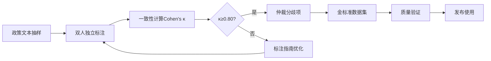

# 03_标注与评估方案

## 文档信息

- **项目名称**: 政策语义因果图谱(PSC-Graph)
- **模块**: 标注质量控制与评估层
- **版本**: v1.0
- **更新日期**: 2025-11-11
- **负责人**: 数据质量组
- **前置依赖**: [01_数据爬取方案.md](01_数据爬取方案.md) 完成

---

## 一、概览与目标

### 1.1 业务目标

本方案是PSC-Graph项目的数据质量保证模块,旨在通过系统化的标注流程和严格的评估标准,为语义抽取、图学习和因果推断提供高质量的金标准数据集。

**核心任务**:
- ✅ **金标准构建**: 建立500-1000条高质量政策要素标注数据
- ✅ **一致性保证**: 通过双人标注+仲裁确保Cohen's κ≥0.80
- ✅ **质量评估**: 建立多层次评测体系(实体/关系/端到端)
- ✅ **人工验收**: 提供系统化的人工抽查清单与验收流程
- ✅ **持续改进**: 通过误差分析指导模型优化

### 1.2 质量门槛体系

```yaml
quality_thresholds:
  annotation_quality:
    entity_relation_f1: "≥0.85"
    cohen_kappa: "≥0.80"
    field_completeness: "≥99%"

  extraction_quality:
    entity_f1: "≥0.85"
    relation_f1: "≥0.80"
    evidence_hit_rate: "≥0.90"

  rag_quality:
    context_relevance: "≥0.85"
    answer_faithfulness: "≥0.90"
    answer_relevance: "≥0.88"

  calibration:
    ece: "≤0.05"
    conformal_coverage: "≥0.90"
```

### 1.3 标注工作流程



**预计时间**: 第1-2周配合数据爬取同步进行

---

## 二、金标准标注规范

### 2.1 标注对象与粒度

#### 📋 标注范围

```yaml
annotation_scope:
  document_types:
    - 国务院政策文件
    - 部委规章制度
    - 省级科技政策
    - 政策解读文件

  granularity:
    unit: "条款/段落(Clause)"
    definition: "以文档中的条、款、项为基本单位"
    min_length: "≥50字"
    max_length: "≤500字"

  target_size:
    total: "500-1000条"
    train: "80% (400-800条)"
    dev: "10% (50-100条)"
    test: "10% (50-100条)"
```

#### 📊 抽样策略

```python
# scripts/sample_for_annotation.py
import json, glob, random
from collections import defaultdict
from pathlib import Path

def stratified_sampling(corpus_dir, n=1000, strata_key="issuer"):
    """分层抽样确保覆盖多样性"""
    docs = []
    for p in Path(corpus_dir).rglob("*.json"):
        doc = json.load(open(p, "r", encoding="utf-8"))
        docs.append(doc)

    # 按发文单位分层
    strata = defaultdict(list)
    for doc in docs:
        key = doc.get(strata_key, "unknown")
        strata[key].append(doc)

    # 每层按比例抽样
    samples = []
    for key, group in strata.items():
        k = max(1, int(n * len(group) / len(docs)))
        samples.extend(random.sample(group, min(k, len(group))))

    # 补足到n
    if len(samples) < n:
        remaining = [d for d in docs if d not in samples]
        samples.extend(random.sample(remaining, n - len(samples)))

    return samples[:n]

def temporal_sampling(corpus_dir, n=1000):
    """时间分层抽样"""
    docs = []
    for p in Path(corpus_dir).rglob("*.json"):
        doc = json.load(open(p, "r", encoding="utf-8"))
        if "pub_date" in doc:
            year = int(doc["pub_date"][:4])
            doc["year"] = year
            docs.append(doc)

    # 按年份分组
    years = defaultdict(list)
    for doc in docs:
        years[doc["year"]].append(doc)

    # 每年按比例抽样
    samples = []
    for year, group in sorted(years.items()):
        k = max(1, int(n * len(group) / len(docs)))
        samples.extend(random.sample(group, min(k, len(group))))

    return samples[:n]

if __name__ == "__main__":
    # 执行分层抽样
    samples = stratified_sampling("corpus", n=1000)

    # 保存到待标注目录
    for i, doc in enumerate(samples):
        output_path = f"annotations/to_annotate/doc_{i:04d}.json"
        json.dump(doc, open(output_path, "w", encoding="utf-8"),
                  ensure_ascii=False, indent=2)

    print(f"[Sampling] Generated {len(samples)} samples")
```

### 2.2 标注要素定义

#### 🔑 五元组核心字段

**完整字段规范** (复用JSON Schema):

| 字段 | 类型 | 必须 | 枚举值/约束 | 说明 |
|-----|------|------|------------|------|
| `goal` | string | ✅ | - | 政策目标/任务 |
| `instrument` | array[string] | ✅ | [funding, tax, land, talent, standard, platform, ip, finance, procurement, pilot, data_compute, other] | 政策工具(可多选) |
| `target_actor` | string | ✅ | - | 对象/主体(企业/高校/科研院所) |
| `region` | object | ❌ | {name, admin_code, uncertain} | 地域/覆盖范围 |
| `timeframe` | object | ❌ | {effective_date, expiry_date} | 时间/有效期 |
| `strength` | integer | ✅ | [0, 1, 2, 3] | 强度/约束性 |
| `support` | array[object] | ❌ | {type, value, unit} | 配套措施(资金/税收等) |
| `evidence_spans` | array[object] | ✅ | {start, end, from_doc} | 证据段落 |
| `confidence` | float | ✅ | [0.0, 1.0] | 主观置信度 |

#### 📝 强度分级标准

```yaml
strength_levels:
  level_3_strong:
    definition: "强约束"
    indicators:
      - 明确资金拨付金额或比例
      - 具有考核/问责机制
      - 硬性准入条件或指标
    keywords: ["必须", "应当", "严格", "考核", "问责"]
    examples:
      - "对符合条件的企业给予不低于500万元研发补贴"
      - "未达标的地区将取消试点资格"

  level_2_moderate:
    definition: "一般性约束"
    indicators:
      - 明确责任单位与时间表
      - 有执行路径但无硬性考核
      - 制度化安排
    keywords: ["明确", "规定", "要求", "落实"]
    examples:
      - "由科技厅牵头,于2024年底前完成平台建设"
      - "各地应建立项目库并定期更新"

  level_1_advisory:
    definition: "倡议性"
    indicators:
      - 鼓励性/引导性表述
      - 无明确执行路径
      - 无约束机制
    keywords: ["鼓励", "支持", "引导", "倡导"]
    examples:
      - "鼓励企业加大研发投入"
      - "支持高校开展产学研合作"

  level_0_background:
    definition: "无约束"
    indicators:
      - 背景性/解释性内容
      - 无可执行工具
      - 泛泛而谈
    keywords: ["形势", "意义", "重要性"]
    examples:
      - "创新是引领发展的第一动力"
      - "加强创新体系建设" (无具体工具)
```

### 2.3 标注流程与规则

#### 🔄 双人标注流程

```yaml
annotation_workflow:
  step_1_assignment:
    action: "将待标注文档随机分配给标注人A和B"
    constraint: "相同文档由两人独立标注"

  step_2_independent_annotation:
    action: "标注人独立完成标注"
    time_limit: "≤30分钟/文档"
    tools: "Label Studio / 自研标注工具"

  step_3_consistency_check:
    action: "系统自动计算一致性(Cohen's κ)"
    threshold: "κ≥0.80"

  step_4_adjudication:
    trigger: "κ<0.80 或 存在分歧项"
    action: "仲裁人裁定最终标注"
    requirement: "仲裁人需记录adjudication_note"

  step_5_finalization:
    action: "通过验证后加入金标准数据集"
    location: "annotations/adjudicated/"
```

#### 📋 标注规则细则

**规则1: 先找工具,再找目标**
```yaml
principle: "优先识别可执行的政策工具,再绑定其服务的目标"

example:
  text: "设立人工智能专项基金,支持企业开展核心技术攻关"
  annotation:
    step_1: "识别工具 = funding (专项基金)"
    step_2: "识别目标 = 核心技术攻关"
    step_3: "识别对象 = 企业"
```

**规则2: 证据溯源强制要求**
```yaml
requirement: "所有抽取内容必须可回溯到原文具体位置"

evidence_spans:
  - 必须提供start和end偏移量
  - 证据文本应完整包含关键信息
  - 跨句/跨段时标注多个span

example:
  text: "第五条 对新认定的国家级研发中心,给予300万元一次性奖励。"
  evidence_spans:
    - {start: 0, end: 38}  # 完整条款
```

**规则3: 模糊信息处理**
```yaml
unclear_region:
  text: "在部分地区开展试点"
  annotation:
    region: {name: "部分地区", admin_code: null, uncertain: true}

missing_amount:
  text: "给予财政补贴"
  annotation:
    support: [{type: "funding", value: null, unit: null, note: "金额未明确"}]

ambiguous_time:
  text: "近期启动实施"
  annotation:
    timeframe: {effective_date: null, note: "时间模糊"}
```

**规则4: 冲突处理机制**
```yaml
conflict_resolution:
  scenario_1:
    issue: "工具类型判断不一致"
    resolution: "仲裁人参考术语表(附录A)裁定"

  scenario_2:
    issue: "强度分级争议"
    resolution: "仲裁人依据指标关键词(必须/应当/鼓励)裁定"

  scenario_3:
    issue: "证据范围不一致"
    resolution: "采用覆盖更完整的span"
```

### 2.4 标注工具配置

#### 🔧 Label Studio配置

```json
{
  "title": "PSC-Graph政策要素标注",
  "type": "layout",
  "children": [
    {
      "type": "View",
      "children": [
        {
          "type": "Header",
          "value": "政策文本"
        },
        {
          "type": "Text",
          "name": "text",
          "value": "$text"
        },
        {
          "type": "Header",
          "value": "标注区"
        },
        {
          "type": "Labels",
          "name": "instrument",
          "toName": "text",
          "choice": "multiple",
          "children": [
            {"value": "funding", "background": "#FFA500"},
            {"value": "tax", "background": "#FFD700"},
            {"value": "land", "background": "#98FB98"},
            {"value": "talent", "background": "#87CEEB"},
            {"value": "standard", "background": "#DDA0DD"},
            {"value": "platform", "background": "#F0E68C"},
            {"value": "ip", "background": "#FFB6C1"},
            {"value": "finance", "background": "#20B2AA"},
            {"value": "procurement", "background": "#FF6347"},
            {"value": "pilot", "background": "#4682B4"},
            {"value": "data_compute", "background": "#9370DB"}
          ]
        },
        {
          "type": "TextArea",
          "name": "goal",
          "toName": "text",
          "placeholder": "输入政策目标/任务",
          "required": true
        },
        {
          "type": "TextArea",
          "name": "target_actor",
          "toName": "text",
          "placeholder": "输入对象/主体",
          "required": true
        },
        {
          "type": "Choices",
          "name": "strength",
          "toName": "text",
          "choice": "single",
          "required": true,
          "children": [
            {"value": "0 - 无约束"},
            {"value": "1 - 倡议"},
            {"value": "2 - 一般性"},
            {"value": "3 - 强约束"}
          ]
        },
        {
          "type": "Rating",
          "name": "confidence",
          "toName": "text",
          "maxRating": 10,
          "defaultValue": 8
        }
      ]
    }
  ]
}
```

---

## 三、一致性评估(Cohen's κ)

### 3.1 计算方法

#### 📊 Cohen's Kappa公式

```
κ = (P_o - P_e) / (1 - P_e)

其中:
- P_o: 观察到的一致性比例
- P_e: 偶然一致性比例
```

**解释标准**:
```yaml
kappa_interpretation:
  excellent: "κ ∈ [0.81, 1.00] - 几乎完全一致"
  good: "κ ∈ [0.61, 0.80] - 实质性一致"
  moderate: "κ ∈ [0.41, 0.60] - 中等一致"
  fair: "κ ∈ [0.21, 0.40] - 一般一致"
  poor: "κ ∈ [0.00, 0.20] - 轻微一致"

project_threshold: "κ ≥ 0.80"
```

### 3.2 计算脚本

```python
# scripts/compute_cohens_kappa.py
import json, glob
import numpy as np
from sklearn.metrics import cohen_kappa_score

def flatten_annotations(doc):
    """将标注扁平化为可比较的元组"""
    items = []
    for clause in doc.get("clauses", []):
        cid = clause["clause_id"]
        for ann in clause.get("annotations", []):
            # 构造标注元组
            item = (
                cid,
                ann.get("goal", "").strip(),
                tuple(sorted(ann.get("instrument", []))),
                ann.get("target_actor", "").strip(),
                ann.get("strength", -1)
            )
            items.append(item)
    return items

def compute_agreement(annotator_a_dir, annotator_b_dir):
    """计算双人标注一致性"""
    a_files = sorted(glob.glob(f"{annotator_a_dir}/*.json"))
    b_files = sorted(glob.glob(f"{annotator_b_dir}/*.json"))

    assert len(a_files) == len(b_files), "标注文件数量不一致"

    kappa_scores = []
    disagreements = []

    for fa, fb in zip(a_files, b_files):
        # 加载标注
        doc_a = json.load(open(fa, "r", encoding="utf-8"))
        doc_b = json.load(open(fb, "r", encoding="utf-8"))

        # 扁平化
        items_a = set(flatten_annotations(doc_a))
        items_b = set(flatten_annotations(doc_b))

        # 构造universe (所有可能的标注)
        universe = sorted(list(items_a | items_b))

        if len(universe) == 0:
            continue

        # 构造二值向量
        y_a = np.array([1 if item in items_a else 0 for item in universe])
        y_b = np.array([1 if item in items_b else 0 for item in universe])

        # 计算kappa
        kappa = cohen_kappa_score(y_a, y_b)
        kappa_scores.append(kappa)

        # 记录分歧
        if kappa < 0.80:
            disagreements.append({
                "file": fa,
                "kappa": kappa,
                "only_in_a": list(items_a - items_b),
                "only_in_b": list(items_b - items_a)
            })

    # 汇总
    mean_kappa = np.mean(kappa_scores)
    print(f"[Cohen's κ] Mean = {mean_kappa:.3f}")
    print(f"[Pass Rate] {sum(k>=0.80 for k in kappa_scores)}/{len(kappa_scores)}")

    # 保存分歧报告
    if disagreements:
        json.dump(disagreements,
                  open("results/disagreements.json", "w", encoding="utf-8"),
                  ensure_ascii=False, indent=2)
        print(f"[Disagreements] {len(disagreements)} files with κ<0.80")

    return mean_kappa, disagreements

if __name__ == "__main__":
    mean_kappa, _ = compute_agreement(
        "annotations/annotator_A",
        "annotations/annotator_B"
    )

    if mean_kappa >= 0.80:
        print("✅ [PASS] Cohen's κ ≥ 0.80")
    else:
        print("❌ [FAIL] Cohen's κ < 0.80, 需要优化标注指南")
```

### 3.3 分歧分析与改进

```python
# scripts/analyze_disagreements.py
import json
from collections import Counter

def analyze_disagreement_patterns(disagreements_path):
    """分析分歧模式,指导标注指南优化"""
    disagreements = json.load(open(disagreements_path, "r", encoding="utf-8"))

    # 统计分歧类型
    instrument_diff = 0
    strength_diff = 0
    goal_diff = 0
    actor_diff = 0

    for d in disagreements:
        for item_a in d["only_in_a"]:
            for item_b in d["only_in_b"]:
                if item_a[0] == item_b[0]:  # 同一条款
                    # 判断分歧类型
                    if item_a[1] != item_b[1]:
                        goal_diff += 1
                    if item_a[2] != item_b[2]:
                        instrument_diff += 1
                    if item_a[3] != item_b[3]:
                        actor_diff += 1
                    if item_a[4] != item_b[4]:
                        strength_diff += 1

    print(f"[Disagreement Types]")
    print(f"  - Instrument: {instrument_diff}")
    print(f"  - Strength: {strength_diff}")
    print(f"  - Goal: {goal_diff}")
    print(f"  - Actor: {actor_diff}")

    # 生成改进建议
    if instrument_diff > strength_diff:
        print("💡 [Suggestion] 优化instrument枚举定义,补充边界案例")
    if strength_diff > instrument_diff:
        print("💡 [Suggestion] 细化strength分级标准,增加关键词示例")

if __name__ == "__main__":
    analyze_disagreement_patterns("results/disagreements.json")
```

---

## 四、质量评估体系

### 4.1 抽取质量评测

#### 📊 实体与关系F1

```python
# scripts/evaluate_extraction.py
import json, glob
from sklearn.metrics import precision_recall_fscore_support

def load_gold_standard(gold_dir):
    """加载金标准数据集"""
    gold = {}
    for p in glob.glob(f"{gold_dir}/*.json"):
        doc = json.load(open(p, "r", encoding="utf-8"))
        doc_id = doc["doc_id"]
        gold[doc_id] = flatten_annotations(doc)
    return gold

def load_predictions(pred_dir):
    """加载模型预测结果"""
    preds = {}
    for p in glob.glob(f"{pred_dir}/*.json"):
        doc = json.load(open(p, "r", encoding="utf-8"))
        doc_id = doc.get("doc_id", p.split("/")[-1].replace(".json", ""))
        preds[doc_id] = flatten_annotations(doc)
    return preds

def compute_f1(gold, preds):
    """计算精确率、召回率、F1"""
    # 构造universe
    all_items = set()
    for items in gold.values():
        all_items.update(items)
    for items in preds.values():
        all_items.update(items)

    universe = sorted(list(all_items))

    # 构造标签向量
    y_true, y_pred = [], []
    for item in universe:
        y_true.append(1 if any(item in g for g in gold.values()) else 0)
        y_pred.append(1 if any(item in p for p in preds.values()) else 0)

    # 计算指标
    p, r, f1, _ = precision_recall_fscore_support(
        y_true, y_pred, average='binary', zero_division=0
    )

    return {
        "precision": p,
        "recall": r,
        "f1": f1
    }

if __name__ == "__main__":
    gold = load_gold_standard("annotations/adjudicated")
    preds = load_predictions("extractions")

    metrics = compute_f1(gold, preds)

    print(f"[Extraction Quality]")
    print(f"  Precision: {metrics['precision']:.3f}")
    print(f"  Recall: {metrics['recall']:.3f}")
    print(f"  F1: {metrics['f1']:.3f}")

    if metrics['f1'] >= 0.85:
        print("✅ [PASS] F1 ≥ 0.85")
    else:
        print("❌ [FAIL] F1 < 0.85")
```

#### 📈 证据命中率

```python
# scripts/evaluate_evidence.py
def compute_evidence_hit_rate(gold, preds):
    """计算证据被正确检索的比例"""
    total_evidence = 0
    hit_evidence = 0

    for doc_id in gold:
        if doc_id not in preds:
            continue

        gold_items = gold[doc_id]
        pred_items = preds[doc_id]

        for g_item in gold_items:
            total_evidence += 1
            # 检查预测中是否包含相同的证据
            for p_item in pred_items:
                if g_item[:4] == p_item[:4]:  # 匹配goal/instrument/actor/strength
                    hit_evidence += 1
                    break

    hit_rate = hit_evidence / total_evidence if total_evidence > 0 else 0
    print(f"[Evidence Hit Rate] {hit_rate:.3f} ({hit_evidence}/{total_evidence})")

    return hit_rate
```

### 4.2 RAG质量评测(ARES)

#### 📋 ARES三维指标

```yaml
ares_metrics:
  context_relevance:
    definition: "检索上下文与查询的相关性"
    threshold: "≥0.85"
    measurement: "人工标注 + 自动评测模型"

  answer_faithfulness:
    definition: "抽取答案对检索证据的忠实度"
    threshold: "≥0.90"
    measurement: "答案是否完全来自证据,无幻觉"

  answer_relevance:
    definition: "抽取答案与查询问题的相关性"
    threshold: "≥0.88"
    measurement: "答案是否直接回答问题"
```

**参考文献**: Saad-Falcon et al., 2023 (arXiv:2311.09476)

#### 🔧 评测数据集构建

```python
# scripts/build_ares_eval_set.py
import json

def create_ares_eval_set(gold_dir, n=200):
    """构建ARES评测数据集"""
    eval_set = []

    for p in glob.glob(f"{gold_dir}/*.json")[:n]:
        doc = json.load(open(p, "r", encoding="utf-8"))

        for clause in doc["clauses"]:
            for ann in clause["annotations"]:
                # 构造查询-上下文-答案三元组
                query = f"请从以下政策中抽取工具和目标: {clause['text'][:100]}..."
                context = clause['text']
                answer = {
                    "goal": ann["goal"],
                    "instrument": ann["instrument"],
                    "target_actor": ann["target_actor"]
                }

                eval_set.append({
                    "query": query,
                    "context": context,
                    "answer": json.dumps(answer, ensure_ascii=False),
                    "evidence_spans": ann["evidence_spans"]
                })

    # 保存
    json.dump(eval_set, open("data/ares_eval_set.json", "w", encoding="utf-8"),
              ensure_ascii=False, indent=2)
    print(f"[ARES] Generated {len(eval_set)} evaluation samples")

if __name__ == "__main__":
    create_ares_eval_set("annotations/adjudicated", n=200)
```

### 4.3 消融实验评测

**实验设计** (复用02方案):

```yaml
ablation_experiments:
  baseline:
    name: "Zero-shot LLM"
    config: "纯GPT-4,无DAPT/TAPT,无RAG"

  ablation_1:
    name: "DAPT only"
    config: "有DAPT,无TAPT,无RAG"

  ablation_2:
    name: "DAPT+TAPT"
    config: "有DAPT+TAPT,无RAG"

  ablation_3:
    name: "RAG only"
    config: "无DAPT/TAPT,有RAG"

  full_model:
    name: "Complete System"
    config: "DAPT+TAPT+RAG+校准"

evaluation_metrics:
  - entity_f1
  - relation_f1
  - evidence_hit_rate
  - inference_time
```

---

## 五、人工验收清单

### 5.1 抽查方案

```yaml
manual_review:
  sample_size: 50
  sampling_strategy: "分层抽样"

  strata:
    by_strength:
      - {level: 3, samples: 20}  # 强约束
      - {level: 2, samples: 15}  # 一般性
      - {level: 1, samples: 10}  # 倡议
      - {level: 0, samples: 5}   # 背景

    by_instrument:
      - {type: "funding", samples: 15}
      - {type: "tax", samples: 10}
      - {type: "talent", samples: 10}
      - {type: "platform", samples: 8}
      - {type: "other", samples: 7}
```

### 5.2 验收检查表

```markdown
# 人工验收检查表

## 文档信息
- 文档ID: _______________
- 标题: _______________
- 审查人: _______________
- 审查日期: _______________

## 检查项

### 1. 字段完整性
- [ ] goal字段非空且有意义
- [ ] instrument至少选择一项
- [ ] target_actor明确
- [ ] strength在[0,3]范围内
- [ ] evidence_spans非空
- [ ] confidence在[0,1]范围内

### 2. 内容准确性
- [ ] goal准确反映政策目标
- [ ] instrument类型选择正确
- [ ] target_actor识别无误
- [ ] strength分级合理

### 3. 证据有效性
- [ ] evidence_spans可回溯到原文
- [ ] 证据文本包含抽取的关键信息
- [ ] 证据范围完整(不截断关键信息)

### 4. 逻辑一致性
- [ ] goal与instrument相匹配
- [ ] instrument与target_actor相关
- [ ] strength与描述用词一致

### 5. 特殊情况处理
- [ ] 模糊信息标记uncertain=true
- [ ] 缺失值使用null而非空字符串
- [ ] 跨句证据标注多个span

## 错误分类
- [ ] 无错误
- [ ] 轻微错误(不影响使用)
- [ ] 中等错误(需要修正)
- [ ] 严重错误(完全错误)

## 错误描述
_______________________________________________
_______________________________________________

## 验收结论
- [ ] 通过
- [ ] 需要修正后复审
- [ ] 不通过

审查人签名: _______________ 日期: _______________
```

### 5.3 验收脚本

```python
# scripts/manual_review.py
import json, glob, random

def generate_review_batch(extraction_dir, n=50, output="review_batch.html"):
    """生成人工验收批次"""
    files = glob.glob(f"{extraction_dir}/*.json")
    sample_files = random.sample(files, min(n, len(files)))

    html = """
    <html>
    <head>
        <meta charset="utf-8">
        <style>
            .review-item { border: 1px solid #ccc; padding: 20px; margin: 20px; }
            .field { margin: 10px 0; }
            .label { font-weight: bold; }
            .evidence { background: #ffffcc; padding: 5px; }
            .checkbox { margin: 5px 0; }
        </style>
    </head>
    <body>
        <h1>人工验收批次 (共{n}条)</h1>
    """.format(n=len(sample_files))

    for i, path in enumerate(sample_files):
        doc = json.load(open(path, "r", encoding="utf-8"))

        html += f"""
        <div class="review-item">
            <h2>样本 {i+1}/{len(sample_files)}</h2>
            <div class="field"><span class="label">文档ID:</span> {doc.get('doc_id')}</div>
            <div class="field"><span class="label">标题:</span> {doc.get('title')}</div>

            <h3>标注内容</h3>
        """

        for clause in doc.get("clauses", []):
            for ann in clause.get("annotations", []):
                html += f"""
                <div class="field"><span class="label">Goal:</span> {ann.get('goal')}</div>
                <div class="field"><span class="label">Instrument:</span> {', '.join(ann.get('instrument', []))}</div>
                <div class="field"><span class="label">Target Actor:</span> {ann.get('target_actor')}</div>
                <div class="field"><span class="label">Strength:</span> {ann.get('strength')}</div>
                <div class="field"><span class="label">Evidence:</span>
                    <div class="evidence">{clause['text'][ann['evidence_spans'][0]['start']:ann['evidence_spans'][0]['end']] if ann.get('evidence_spans') else 'N/A'}</div>
                </div>
                """

        html += """
            <h3>检查项</h3>
            <div class="checkbox">☐ 字段完整性</div>
            <div class="checkbox">☐ 内容准确性</div>
            <div class="checkbox">☐ 证据有效性</div>
            <div class="checkbox">☐ 逻辑一致性</div>

            <h3>验收结论</h3>
            <div class="checkbox">☐ 通过 ☐ 需修正 ☐ 不通过</div>
            <div><label>备注:</label> <textarea rows="3" cols="80"></textarea></div>
        </div>
        """

    html += "</body></html>"

    with open(output, "w", encoding="utf-8") as f:
        f.write(html)

    print(f"[Manual Review] Generated {output} with {len(sample_files)} samples")

if __name__ == "__main__":
    generate_review_batch("extractions", n=50, output="results/review_batch.html")
```

---

## 六、误差分析与改进

### 6.1 错误类型分类

```yaml
error_taxonomy:
  type_1_entity_errors:
    description: "实体识别错误"
    subtypes:
      - 遗漏关键实体
      - 错误识别非实体
      - 边界识别错误

  type_2_relation_errors:
    description: "关系抽取错误"
    subtypes:
      - goal与instrument不匹配
      - target_actor识别错误
      - strength分级错误

  type_3_evidence_errors:
    description: "证据溯源错误"
    subtypes:
      - evidence_spans不完整
      - 证据与抽取内容不符
      - 跨句证据标注缺失

  type_4_format_errors:
    description: "格式规范错误"
    subtypes:
      - JSON Schema验证失败
      - 必须字段缺失
      - 枚举值不规范
```

### 6.2 误差分析脚本

```python
# scripts/error_analysis.py
import json, glob
from collections import Counter

def analyze_errors(gold_dir, pred_dir):
    """分析模型预测错误"""
    gold = load_gold_standard(gold_dir)
    preds = load_predictions(pred_dir)

    errors = {
        "false_negatives": [],  # 漏抽
        "false_positives": [],  # 误抽
        "strength_errors": [],  # 强度错误
        "instrument_errors": []  # 工具类型错误
    }

    for doc_id in gold:
        if doc_id not in preds:
            errors["false_negatives"].extend(gold[doc_id])
            continue

        gold_items = set(gold[doc_id])
        pred_items = set(preds[doc_id])

        # 漏抽
        fn = gold_items - pred_items
        errors["false_negatives"].extend(fn)

        # 误抽
        fp = pred_items - gold_items
        errors["false_positives"].extend(fp)

        # 强度错误
        for g in gold_items:
            for p in pred_items:
                if g[:3] == p[:3] and g[4] != p[4]:  # 同一条款,强度不同
                    errors["strength_errors"].append((g, p))

    # 统计
    print(f"[Error Analysis]")
    print(f"  False Negatives: {len(errors['false_negatives'])}")
    print(f"  False Positives: {len(errors['false_positives'])}")
    print(f"  Strength Errors: {len(errors['strength_errors'])}")

    # 分析高频错误模式
    instrument_counter = Counter()
    for item in errors["false_negatives"]:
        instrument_counter.update(item[2])  # instrument tuple

    print(f"\n[Most Missed Instruments]")
    for inst, count in instrument_counter.most_common(5):
        print(f"  - {inst}: {count}")

    return errors

if __name__ == "__main__":
    errors = analyze_errors("annotations/adjudicated", "extractions")

    # 保存错误案例
    json.dump(errors, open("results/error_analysis.json", "w", encoding="utf-8"),
              ensure_ascii=False, indent=2, default=list)
```

### 6.3 改进措施

```yaml
improvement_strategies:
  high_fn_rate:
    issue: "漏抽率高(召回率低)"
    solutions:
      - 增加few-shot示例数量
      - 优化RAG检索参数(提高召回)
      - 补充TAPT训练数据

  high_fp_rate:
    issue: "误抽率高(精确率低)"
    solutions:
      - 强化证据溯源约束
      - 提高置信度阈值
      - 增加后处理验证规则

  strength_confusion:
    issue: "强度分级混淆"
    solutions:
      - 补充强度分级训练样本
      - 优化提示词中的关键词列表
      - 引入多轮对话确认

  instrument_misclass:
    issue: "工具类型误判"
    solutions:
      - 细化instrument枚举定义
      - 补充边界案例到few-shot
      - 构建术语-工具映射表
```

---

## 七、实施步骤

### 7.1 Week 1: 标注准备

**Day 1-2: 抽样与分配**
```bash
# 执行分层抽样
python scripts/sample_for_annotation.py \
    --corpus corpus \
    --output annotations/to_annotate \
    --n 1000 \
    --strategy stratified

# 随机分配给标注人A和B
python scripts/assign_annotators.py \
    --input annotations/to_annotate \
    --output_a annotations/annotator_A \
    --output_b annotations/annotator_B
```

**Day 3-5: 标注培训**
```yaml
training_agenda:
  session_1: "标注指南讲解(2小时)"
  session_2: "示例标注练习(2小时)"
  session_3: "试标注与反馈(10条)"
  session_4: "正式标注启动"
```

### 7.2 Week 2: 标注执行与质控

**Day 6-10: 双人标注**
```yaml
annotation_schedule:
  daily_quota: "100条/人"
  quality_check: "每日末尾抽查10条"
  progress_tracking: "每日报告完成进度"

  tools:
    - Label Studio Web界面
    - 标注指南PDF
    - 术语表Excel
```

**Day 11-12: 一致性计算与仲裁**
```bash
# 计算Cohen's κ
python scripts/compute_cohens_kappa.py \
    --annotator_a annotations/annotator_A \
    --annotator_b annotations/annotator_B \
    --output results/kappa_report.json

# 如果κ<0.80,分析分歧模式
python scripts/analyze_disagreements.py \
    --disagreements results/disagreements.json

# 仲裁分歧项
python scripts/adjudication_ui.py \
    --disagreements results/disagreements.json \
    --output annotations/adjudicated
```

### 7.3 Week 3-4: 质量验证(配合02方案)

**Day 13-14: 抽取质量评测**
```bash
# 在测试集上评测抽取模型
python scripts/evaluate_extraction.py \
    --gold annotations/adjudicated \
    --predictions extractions \
    --output results/extraction_metrics.json

# 如果F1<0.85,执行误差分析
python scripts/error_analysis.py \
    --gold annotations/adjudicated \
    --predictions extractions \
    --output results/error_analysis.json
```

---

## 八、验收标准

### 8.1 标注质量

```yaml
annotation_quality:
  completeness:
    metric: "字段完整性"
    threshold: "≥99%"
    measurement: "必须字段非空比例"

  consistency:
    metric: "Cohen's κ"
    threshold: "≥0.80"
    measurement: "双人标注一致性"

  accuracy:
    metric: "人工抽查准确率"
    threshold: "≥95%"
    sample_size: 50
```

### 8.2 抽取质量

```yaml
extraction_quality:
  entity_f1:
    threshold: "≥0.85"
    measurement: "实体识别F1"

  relation_f1:
    threshold: "≥0.80"
    measurement: "五元组完整匹配F1"

  evidence_hit_rate:
    threshold: "≥0.90"
    measurement: "证据被检索到的比例"
```

### 8.3 RAG质量

```yaml
rag_quality:
  context_relevance:
    threshold: "≥0.85"
    measurement: "ARES上下文相关性"

  answer_faithfulness:
    threshold: "≥0.90"
    measurement: "ARES答案忠实度"

  answer_relevance:
    threshold: "≥0.88"
    measurement: "ARES答案相关性"
```

---

## 九、常见问题与故障排除

### Q1: Cohen's κ持续低于0.80

**诊断**:
```bash
python scripts/analyze_disagreements.py --disagreements results/disagreements.json
```

**解决方案**:
1. 召开标注讨论会,统一理解
2. 补充边界案例到标注指南
3. 增加标注前培训时间
4. 考虑更换标注工具(提高操作便利性)

### Q2: 抽取F1低于0.85

**排查步骤**:
```python
# 1. 检查错误类型分布
python scripts/error_analysis.py

# 2. 如果FN率高(召回低)
#    → 增加few-shot示例,优化RAG召回参数

# 3. 如果FP率高(精确率低)
#    → 强化证据约束,提高置信度阈值
```

### Q3: 标注效率低下

**优化措施**:
```yaml
efficiency_improvements:
  pre_annotation:
    action: "使用模型预标注,人工修正"
    speedup: "2-3倍"

  active_learning:
    action: "优先标注不确定性高的样本"
    benefit: "减少标注量20-30%"

  batch_labeling:
    action: "相似文档批量标注"
    benefit: "复用思路,提高速度"
```

---

## 十、附录

### 附录A: 标注指南完整版

**请参考项目方案细节.txt第A节**,包含:
- 标注对象与粒度
- 五元组字段定义
- 强度分级标准
- 标注流程与规则
- 边界与例外处理

### 附录B: 术语-工具映射表

```yaml
terminology_mapping:
  funding:
    keywords: ["补贴", "资助", "专项资金", "奖励", "扶持资金"]

  tax:
    keywords: ["税收优惠", "减免税", "抵扣", "退税", "所得税优惠"]

  talent:
    keywords: ["人才引进", "人才补贴", "住房补贴", "落户", "职称"]

  platform:
    keywords: ["平台", "孵化器", "加速器", "园区", "中心", "基地"]

  ip:
    keywords: ["知识产权", "专利", "商标", "成果转化", "技术转移"]

  procurement:
    keywords: ["政府采购", "首购", "首台套", "示范应用"]

  standard:
    keywords: ["标准", "规范", "准入", "认证", "资质"]
```

### 附录C: 参考文献

```yaml
key_references:
  cohen_kappa:
    - "Cohen J., 1960: A Coefficient of Agreement for Nominal Scales"
    - "Landis & Koch, 1977: The Measurement of Observer Agreement"

  ares:
    - "Saad-Falcon et al., 2023: ARES Automated Evaluation Framework"
    - "URL: https://arxiv.org/abs/2311.09476"

  annotation_quality:
    - "Artstein & Poesio, 2008: Inter-Coder Agreement for Computational Linguistics"
    - "URL: https://aclanthology.org/J08-4004/"
```

---

## 总结

本标注与评估方案提供了**系统化、可量化、可审计**的质量保证流程,确保:

✅ **标注完整性**: 500-1000条金标准数据,覆盖多样场景
✅ **一致性保证**: Cohen's κ≥0.80,双人标注+仲裁机制
✅ **评测体系**: 实体/关系F1、RAG质量、消融实验
✅ **人工验收**: 50条抽查,95%准确率要求
✅ **持续改进**: 误差分析驱动模型优化

**下一步行动**:
1. ✅ Day 1-2: 执行分层抽样,生成待标注数据
2. ✅ Day 3-5: 标注培训与试标注
3. ✅ Day 6-10: 双人独立标注
4. ✅ Day 11-12: 一致性计算与仲裁
5. ✅ Day 13-14: 质量评测与误差分析

**联系方式**:
- 技术支持: quality@psc-graph.org
- 项目管理: pm@psc-graph.org

---

**文档版本**: v1.0
**生成时间**: 2025-11-11
**维护者**: PSC-Graph数据质量组
**最后更新**: 2025-11-11
