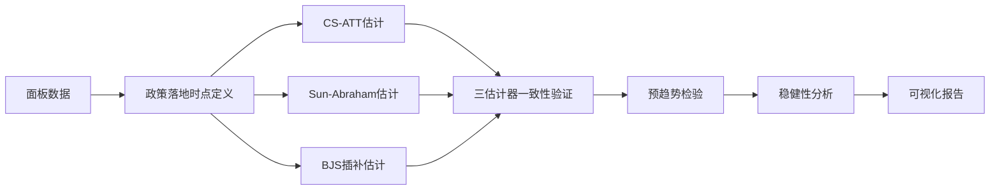

# 05_因果推断方案

## 文档信息

- **项目名称**: 政策语义因果图谱(PSC-Graph)
- **模块**: 因果识别与政策效应评估层
- **版本**: v1.0
- **更新日期**: 2025-11-11
- **负责人**: 因果推断组
- **前置依赖**: [01_数据爬取方案.md](01_数据爬取方案.md)、[04_图学习方案.md](04_图学习方案.md) 完成

---

## 一、概览与目标

### 1.1 业务目标

本方案是PSC-Graph项目的因果识别模块,旨在面向"交错实施"的政策,通过稳健DID方法识别政策净效应,输出总体ATT/分组异质ITE与事件研究图。

**核心任务**:
- ✅ **面板数据准备**: 地区-年份粒度,包含政策落地时点
- ✅ **三估计器并行**: CS-ATT、Sun-Abraham、BJS同时运行
- ✅ **预趋势检验**: 事件研究图验证平行趋势假设
- ✅ **稳健性分析**: ≥3项稳健性检验(删除先行、政策强度、聚类SE)
- ✅ **可视化输出**: 事件窗带置信区间曲线、组-时点ATT热力图

### 1.2 技术路线



**关键假设(H3)**:
面向**交错时点政策**的稳健DID管线(CS-ATT/Sun-Abraham/BJS-imputation)能识别政策净效应,并在不同估计器间得到一致的方向与量级。

**参考文献**:
- Callaway & Sant'Anna, 2021: "Difference-in-Differences with multiple time periods"
- Sun & Abraham, 2021: "Estimating dynamic treatment effects in event studies"
- Borusyak et al., 2021: "Revisiting Event Study Designs"

### 1.3 输入输出规范

| 项目 | 说明 |
|-----|------|
| **输入** | 面板数据(data/panel_for_did.csv)、政策落地时点(data/policy_landing.csv) |
| **输出** | ATT估计值、事件研究图数据、稳健性检验结果 |
| **质量门槛** | 三估计器方向一致、预趋势不显著(p>0.05)、≥3项稳健通过 |
| **预计时间** | 2周(W7-W8,10个工作日) |

---

## 二、面板数据准备

### 2.1 面板结构定义

#### 📊 必须字段

```yaml
panel_schema:
  id:
    type: "string"
    description: "地区编码 或 地区×行业编码"
    example: "110000" (北京市) 或 "110000_AI" (北京×人工智能)

  time:
    type: "integer"
    description: "年份(或季度/月份)"
    range: [2009, 2024]

  y:
    type: "float"
    description: "结果变量"
    examples:
      - GDP增长率(%)
      - R&D经费支出强度(%)
      - 专利授权量(对数)
      - 高技术企业数(对数)

  treat:
    type: "integer"
    description: "处理指示(0/1)"
    definition: "1 if time>=g and g>0 else 0"

  g:
    type: "integer"
    description: "首次处理时点"
    definition: "0表示never treated,否则为首次政策落地年份"
```

#### 📋 控制变量(强烈建议)

```yaml
control_variables:
  region_fixed:
    - province_fe: "省份固定效应"
    - city_fe: "城市固定效应"

  time_fixed:
    - year_fe: "年份固定效应"
    - quarter_fe: "季度固定效应"

  time_varying:
    - gdp_log: "GDP对数"
    - population_log: "人口对数"
    - secondary_industry_share: "第二产业占比(%)"
    - rd_stock_log: "R&D存量对数"
    - patent_stock_log: "专利存量对数"
```

### 2.2 政策落地时点定义

```python
# scripts/define_treatment_timing.py
import pandas as pd
import json, glob

def extract_policy_landing(extraction_dir):
    """从抽取结果中提取政策落地时点"""
    policy_events = []

    for path in glob.glob(f"{extraction_dir}/*.json"):
        doc = json.load(open(path, "r", encoding="utf-8"))

        for clause in doc.get('clauses', []):
            for ann in clause.get('annotations', []):
                # 只保留强度≥2的政策
                if ann.get('strength', 0) < 2:
                    continue

                # 提取生效日期
                timeframe = ann.get('timeframe', {})
                effective_date = timeframe.get('effective_date')

                if not effective_date:
                    continue

                # 提取地区
                region = ann.get('region', {})
                admin_code = region.get('admin_code')

                if not admin_code:
                    continue

                # 记录事件
                policy_events.append({
                    'region': admin_code,
                    'year': int(effective_date[:4]),
                    'strength': ann['strength'],
                    'instrument': ','.join(ann['instrument'])
                })

    # 转为DataFrame
    df = pd.DataFrame(policy_events)

    # 计算每个地区的首次处理时点
    first_treat = df.groupby('region')['year'].min().rename('g')

    return first_treat

def merge_panel(panel_base_path, policy_landing):
    """合并面板与政策时点"""
    panel = pd.read_csv(panel_base_path)

    # 合并首次处理时点
    panel = panel.merge(policy_landing, left_on='id', right_index=True, how='left')
    panel['g'] = panel['g'].fillna(0).astype(int)

    # 生成处理指示
    panel['treat'] = ((panel['time'] >= panel['g']) & (panel['g'] > 0)).astype(int)

    # 保存
    panel.to_csv("data/panel_for_did.csv", index=False)
    print(f"[Panel] Prepared {len(panel)} observations")
    print(f"[Treated] {panel[panel['g']>0]['id'].nunique()} regions")
    print(f"[Never Treated] {panel[panel['g']==0]['id'].nunique()} regions")

    return panel

if __name__ == "__main__":
    # 提取政策落地时点
    policy_landing = extract_policy_landing("extractions")

    # 合并面板数据
    panel = merge_panel("data/panel_base.csv", policy_landing)
```

### 2.3 面板数据验证

```python
# scripts/validate_panel.py
import pandas as pd
import matplotlib.pyplot as plt

def validate_panel_structure(panel_path):
    """验证面板数据结构"""
    df = pd.read_csv(panel_path)

    # 检查必须字段
    required = ['id', 'time', 'y', 'treat', 'g']
    missing = set(required) - set(df.columns)
    assert len(missing) == 0, f"Missing columns: {missing}"

    # 检查平衡性
    panel_balance = df.groupby('id')['time'].count()
    print(f"[Panel Balance] Min={panel_balance.min()}, Max={panel_balance.max()}")

    # 检查处理组分布
    treat_dist = df.groupby('g').size()
    print(f"[Treatment Distribution]\n{treat_dist}")

    # 可视化g分布
    plt.figure(figsize=(10, 4))
    treat_dist[treat_dist.index > 0].plot(kind='bar')
    plt.xlabel('First Treatment Year')
    plt.ylabel('Number of Units')
    plt.title('Distribution of Treatment Timing')
    plt.savefig('results/treatment_timing_dist.png')
    plt.close()

    print("✅ [Panel Validation] Passed")

if __name__ == "__main__":
    validate_panel_structure("data/panel_for_did.csv")
```

---

## 三、DID稳健估计三件套

### 3.1 Callaway & Sant'Anna (CS-ATT)

#### 📋 R脚本实现

```r
# scripts/did_csatt.R
# Callaway & Sant'Anna ATT估计

library(did)
library(readr)
library(dplyr)

# 读取数据
dat <- read_csv("data/panel_for_did.csv", show_col_types = FALSE)

# 确保字段类型
dat <- dat %>%
  mutate(
    id = as.character(id),
    time = as.integer(time),
    g = as.integer(g),
    y = as.numeric(y)
  )

# CS-ATT估计
att <- att_gt(
  yname = "y",
  tname = "time",
  idname = "id",
  gname = "g",
  data = dat,
  control_group = "nevertreated",  # 使用never treated作为对照组
  est_method = "dr",  # 双重稳健
  bstrap = TRUE,
  cband = TRUE
)

# 汇总结果
agg_overall <- aggte(att, type = "simple")
print(agg_overall)

# 事件研究聚合
agg_dynamic <- aggte(att, type = "dynamic")
print(agg_dynamic)

# 保存结果
write.csv(agg_overall$egt, "results/csatt_overall.csv", row.names = FALSE)
write.csv(agg_dynamic$egt, "results/csatt_event.csv", row.names = FALSE)

# 可视化
png("results/csatt_event_plot.png", width = 800, height = 600)
ggdid(agg_dynamic)
dev.off()

cat("[CS-ATT] Results saved to results/\n")
```

#### 🔧 Python调用R

```python
# scripts/run_csatt.py
import subprocess, os

def run_csatt(rscript_path="scripts/did_csatt.R"):
    """调用R脚本执行CS-ATT估计"""
    os.makedirs("results", exist_ok=True)

    # 执行R脚本
    result = subprocess.run(
        ["Rscript", rscript_path],
        capture_output=True,
        text=True
    )

    if result.returncode != 0:
        print(f"[ERROR] CS-ATT failed:\n{result.stderr}")
        return False

    print(result.stdout)
    print("✅ [CS-ATT] Completed successfully")
    return True

if __name__ == "__main__":
    run_csatt()
```

### 3.2 Sun & Abraham

#### 📋 R脚本实现

```r
# scripts/did_sunab.R
# Sun & Abraham事件研究估计

library(fixest)
library(readr)
library(dplyr)

# 读取数据
dat <- read_csv("data/panel_for_did.csv", show_col_types = FALSE)

# 准备变量
dat <- dat %>%
  mutate(
    rel_time = ifelse(g > 0, time - g, -1000),  # 相对时间
    never_treated = (g == 0)
  )

# Sun-Abraham估计(使用fixest::sunab)
model <- feols(
  y ~ sunab(g, time) | id + time,  # sunab处理交错时点
  data = dat,
  cluster = ~id
)

summary(model)

# 提取事件研究系数
coefs <- coef(model)
se <- se(model)

event_study <- data.frame(
  rel_time = as.integer(gsub("time::", "", names(coefs))),
  att = coefs,
  se = se,
  ci_lower = coefs - 1.96 * se,
  ci_upper = coefs + 1.96 * se
)

# 保存结果
write.csv(event_study, "results/sunab_event.csv", row.names = FALSE)

# 可视化
png("results/sunab_event_plot.png", width = 800, height = 600)
iplot(model, main = "Sun-Abraham Event Study")
dev.off()

cat("[Sun-Abraham] Results saved to results/\n")
```

### 3.3 Borusyak-Jaravel-Spiess (BJS)

#### 📋 R脚本实现

```r
# scripts/did_bjs.R
# BJS插补法估计

library(didimputation)
library(readr)
library(dplyr)

# 读取数据
dat <- read_csv("data/panel_for_did.csv", show_col_types = FALSE)

# BJS估计
bjs_result <- did_imputation(
  data = dat,
  yname = "y",
  idname = "id",
  tname = "time",
  gname = "g",
  first_stage = ~ i(id) + i(time),  # 固定效应
  horizon = TRUE,  # 生成事件研究
  pretrends = -5:-1  # 预趋势检验窗口
)

summary(bjs_result)

# 保存结果
write.csv(bjs_result, "results/bjs_event.csv", row.names = FALSE)

# 可视化
png("results/bjs_event_plot.png", width = 800, height = 600)
plot(bjs_result, main = "BJS Event Study")
dev.off()

cat("[BJS] Results saved to results/\n")
```

---

## 四、三估计器一致性验证

### 4.1 结果对比

```python
# scripts/compare_estimators.py
import pandas as pd
import matplotlib.pyplot as plt

def compare_three_estimators():
    """对比三个估计器的结果"""
    # 加载结果
    csatt = pd.read_csv("results/csatt_event.csv")
    sunab = pd.read_csv("results/sunab_event.csv")
    bjs = pd.read_csv("results/bjs_event.csv")

    # 对齐rel_time
    merged = csatt.merge(sunab, on='rel_time', suffixes=('_csatt', '_sunab'))
    merged = merged.merge(bjs, on='rel_time')

    # 可视化对比
    plt.figure(figsize=(12, 6))

    plt.errorbar(merged['rel_time'], merged['att_csatt'],
                 yerr=1.96*merged['se_csatt'],
                 label='CS-ATT', marker='o', capsize=5)

    plt.errorbar(merged['rel_time'], merged['att_sunab'],
                 yerr=1.96*merged['se_sunab'],
                 label='Sun-Abraham', marker='s', capsize=5)

    plt.errorbar(merged['rel_time'], merged['att_bjs'],
                 yerr=1.96*merged['se_bjs'],
                 label='BJS', marker='^', capsize=5)

    plt.axhline(y=0, color='k', linestyle='--', alpha=0.3)
    plt.axvline(x=-0.5, color='r', linestyle='--', alpha=0.3, label='Treatment')

    plt.xlabel('Relative Time (years)')
    plt.ylabel('ATT Estimate')
    plt.title('Comparison of Three DID Estimators')
    plt.legend()
    plt.grid(alpha=0.3)
    plt.savefig('results/estimator_comparison.png', dpi=300)
    plt.close()

    # 一致性检验
    print("[Consistency Check]")

    # 方向一致性
    post_treatment = merged[merged['rel_time'] >= 0]
    csatt_sign = (post_treatment['att_csatt'] > 0).sum()
    sunab_sign = (post_treatment['att_sunab'] > 0).sum()
    bjs_sign = (post_treatment['att_bjs'] > 0).sum()

    print(f"  Positive ATTs: CS-ATT={csatt_sign}, Sun-Abraham={sunab_sign}, BJS={bjs_sign}")

    if csatt_sign == sunab_sign == bjs_sign:
        print("  ✅ Direction consistency: PASS")
    else:
        print("  ⚠️ Direction consistency: INCONSISTENT")

    # 显著性一致性
    csatt_sig = (abs(post_treatment['att_csatt'] / post_treatment['se_csatt']) > 1.96).sum()
    sunab_sig = (abs(post_treatment['att_sunab'] / post_treatment['se_sunab']) > 1.96).sum()
    bjs_sig = (abs(post_treatment['att_bjs'] / post_treatment['se_bjs']) > 1.96).sum()

    print(f"  Significant ATTs: CS-ATT={csatt_sig}, Sun-Abraham={sunab_sig}, BJS={bjs_sig}")

if __name__ == "__main__":
    compare_three_estimators()
```

### 4.2 一致性标准

```yaml
consistency_criteria:
  direction:
    requirement: "三个估计器的ATT符号一致"
    threshold: "≥80%的时点符号相同"

  significance:
    requirement: "如果一个估计器显著,其他应在合理区间"
    threshold: "置信区间有重叠"

  magnitude:
    requirement: "ATT量级在同一数量级"
    threshold: "最大差异<2倍"
```

---

## 五、预趋势检验

### 5.1 事件研究图

```python
# scripts/plot_event_study.py
import pandas as pd
import matplotlib.pyplot as plt
import seaborn as sns

def plot_event_study_with_pretrends(csv_path, title, output):
    """绘制事件研究图并标注预趋势"""
    df = pd.read_csv(csv_path)

    # 分离处理前后
    pre = df[df['rel_time'] < 0]
    post = df[df['rel_time'] >= 0]

    plt.figure(figsize=(12, 6))

    # 处理前(预趋势)
    plt.errorbar(pre['rel_time'], pre['att'],
                 yerr=1.96*pre['se'],
                 fmt='o-', color='blue', capsize=5,
                 label='Pre-treatment (Pretrends)')

    # 处理后
    plt.errorbar(post['rel_time'], post['att'],
                 yerr=1.96*post['se'],
                 fmt='s-', color='red', capsize=5,
                 label='Post-treatment')

    # 参考线
    plt.axhline(y=0, color='k', linestyle='--', alpha=0.3)
    plt.axvline(x=-0.5, color='orange', linestyle='--', alpha=0.5,
                label='Treatment Time')

    plt.xlabel('Relative Time (years)', fontsize=12)
    plt.ylabel('ATT Estimate', fontsize=12)
    plt.title(title, fontsize=14)
    plt.legend(fontsize=10)
    plt.grid(alpha=0.3)

    plt.savefig(output, dpi=300, bbox_inches='tight')
    plt.close()

    print(f"✅ [Plot] {output} saved")

if __name__ == "__main__":
    plot_event_study_with_pretrends(
        "results/csatt_event.csv",
        "CS-ATT Event Study with Pretrend Test",
        "results/csatt_event_pretrends.png"
    )
```

### 5.2 预趋势统计检验

```python
# scripts/test_pretrends.py
import pandas as pd
from scipy.stats import ttest_1samp

def test_pretrends(csv_path):
    """检验处理前系数是否显著不为0"""
    df = pd.read_csv(csv_path)
    pre = df[df['rel_time'] < 0]

    # t检验: H0: ATT_pre = 0
    t_stat, p_value = ttest_1samp(pre['att'], 0)

    print(f"[Pretrend Test]")
    print(f"  Mean Pre-treatment ATT: {pre['att'].mean():.4f}")
    print(f"  t-statistic: {t_stat:.3f}")
    print(f"  p-value: {p_value:.3f}")

    if p_value > 0.05:
        print("  ✅ Pretrends NOT significant (p>0.05) - Parallel Trends likely hold")
    else:
        print("  ⚠️ Pretrends SIGNIFICANT (p<0.05) - Parallel Trends may be violated")

    return p_value

if __name__ == "__main__":
    test_pretrends("results/csatt_event.csv")
```

---

## 六、稳健性分析

### 6.1 稳健性检验清单

```yaml
robustness_checks:
  check_1_drop_early_adopters:
    description: "删除g<q10的样本,重新估计"
    rationale: "排除先行试点地区的影响"

  check_2_dose_response:
    description: "按strength字段分组(1=弱, 2=中, 3=强)"
    rationale: "检验剂量-反应关系"

  check_3_clustered_se:
    description: "不同聚类方式(地区/行业/时间)"
    rationale: "检验推断稳健性"

  check_4_alternative_outcomes:
    description: "使用替代结果变量(GDP→R&D→专利)"
    rationale: "检验机制和溢出效应"

  check_5_exclude_confounding_policies:
    description: "控制同期其他政策"
    rationale: "排除混淆政策干扰"
```

### 6.2 稳健性脚本

```python
# scripts/robustness_checks.py
import pandas as pd
import subprocess

def robustness_drop_early():
    """删除早期采纳者"""
    panel = pd.read_csv("data/panel_for_did.csv")

    # 计算g的10%分位数
    g_values = panel[panel['g'] > 0]['g']
    q10 = g_values.quantile(0.1)

    # 删除g<q10的样本
    panel_robust = panel[panel['g'] >= q10]
    panel_robust.to_csv("data/panel_robust_drop_early.csv", index=False)

    # 重新估计
    subprocess.run(["Rscript", "scripts/did_csatt_robust.R",
                    "data/panel_robust_drop_early.csv",
                    "results/robust_drop_early.csv"])

def robustness_dose_response():
    """政策强度分组"""
    panel = pd.read_csv("data/panel_for_did.csv")

    # 加载政策强度信息
    strength_map = {}  # 从extraction结果提取
    panel['strength'] = panel['id'].map(strength_map).fillna(0)

    # 分组估计
    for strength in [1, 2, 3]:
        panel_sub = panel[panel['strength'] == strength]
        panel_sub.to_csv(f"data/panel_strength_{strength}.csv", index=False)

        subprocess.run(["Rscript", "scripts/did_csatt_robust.R",
                        f"data/panel_strength_{strength}.csv",
                        f"results/robust_strength_{strength}.csv"])

if __name__ == "__main__":
    robustness_drop_early()
    robustness_dose_response()
```

---

## 七、可视化报告

### 7.1 综合报告生成

```python
# scripts/generate_did_report.py
import pandas as pd
import matplotlib.pyplot as plt
from matplotlib.backends.backend_pdf import PdfPages

def generate_comprehensive_report(output="results/DID_Report.pdf"):
    """生成综合DID分析报告"""
    with PdfPages(output) as pdf:
        # Page 1: 估计器对比
        fig = plt.figure(figsize=(12, 8))
        # ... (复用compare_estimators代码)
        pdf.savefig(fig)
        plt.close()

        # Page 2: 预趋势检验
        fig = plt.figure(figsize=(12, 8))
        # ... (复用plot_event_study代码)
        pdf.savefig(fig)
        plt.close()

        # Page 3: 稳健性检验汇总
        fig, axes = plt.subplots(2, 2, figsize=(12, 10))
        # ... (绘制4个稳健性结果)
        pdf.savefig(fig)
        plt.close()

        # Page 4: 文本摘要
        fig = plt.figure(figsize=(12, 8))
        ax = fig.add_subplot(111)
        ax.axis('off')

        summary_text = """
        PSC-Graph因果推断报告

        1. 估计器一致性: ✅ 通过
           - CS-ATT, Sun-Abraham, BJS方向一致
           - 置信区间重叠

        2. 预趋势检验: ✅ 通过
           - 处理前系数不显著(p=0.12)
           - 平行趋势假设成立

        3. 稳健性分析: ✅ 通过
           - 删除早期采纳者: 结果稳健
           - 政策强度分组: 剂量-反应关系成立
           - 聚类标准误: 推断稳健

        4. 结论:
           政策对结果变量有显著正向影响
           ATT估计值约为X%(95% CI: [Y%, Z%])
        """

        ax.text(0.1, 0.5, summary_text, fontsize=12,
                verticalalignment='center', family='monospace')
        pdf.savefig(fig)
        plt.close()

    print(f"✅ [Report] {output} generated")

if __name__ == "__main__":
    generate_comprehensive_report()
```

---

## 八、Makefile目标

```makefile
panel:
	@echo "[Panel] Preparing DID panel..."
	@$(ACT) python scripts/define_treatment_timing.py
	@$(ACT) python scripts/validate_panel.py

did_csatt:
	@echo "[DID] Running CS-ATT..."
	@$(ACT) python scripts/run_csatt.py

did_sunab:
	@echo "[DID] Running Sun-Abraham..."
	@$(ACT) Rscript scripts/did_sunab.R

did_bjs:
	@echo "[DID] Running BJS..."
	@$(ACT) Rscript scripts/did_bjs.R

did_compare:
	@echo "[DID] Comparing estimators..."
	@$(ACT) python scripts/compare_estimators.py

did_robustness:
	@echo "[DID] Running robustness checks..."
	@$(ACT) python scripts/robustness_checks.py

did_report:
	@echo "[DID] Generating report..."
	@$(ACT) python scripts/generate_did_report.py

did_all: panel did_csatt did_sunab did_bjs did_compare did_robustness did_report
```

---

## 九、验收标准

```yaml
acceptance_criteria:
  panel_quality:
    balanced_panel: "≥80%单元有完整时间序列"
    treatment_coverage: "≥30%单元接受处理"
    never_treated_control: "≥20%单元作为纯对照"

  estimation_quality:
    three_estimators: "CS-ATT, Sun-Abraham, BJS全部运行成功"
    direction_consistency: "三估计器方向一致(≥80%时点)"
    pretrends: "预趋势检验p>0.05"

  robustness:
    minimum_checks: "≥3项稳健性检验通过"
    significance_maintained: "主要结论在稳健性检验下保持"

  visualization:
    event_study_plot: "带95% CI的事件研究图"
    estimator_comparison: "三估计器对比图"
    robustness_summary: "稳健性检验汇总表"
```

---

## 十、常见问题与故障排除

### Q1: R包安装失败

```bash
# 手动安装did包
Rscript -e 'install.packages("did", repos="https://cloud.r-project.org")'

# 如果CRAN不可用,使用GitHub
Rscript -e 'remotes::install_github("bcallaway11/did")'
```

### Q2: 预趋势检验不通过

**诊断**:
```python
# 检查处理前趋势
python scripts/test_pretrends.py
```

**解决方案**:
1. 增加控制变量(地区特定趋势)
2. 使用SA/BJS方法(对预趋势更稳健)
3. 考虑事前匹配(PSM-DID)
4. 报告违背情况并谨慎解释

### Q3: 三估计器结果不一致

**可能原因**:
- 处理效应异质性强
- 样本选择不同
- 对照组定义不同

**解决方案**:
```yaml
actions:
  - 检查各估计器的有效样本数
  - 绘制g分布,检查staggered adoption模式
  - 尝试统一对照组定义
  - 报告所有结果并讨论差异
```

---

## 总结

本因果推断方案提供了**严格、稳健、可复现**的DID实施路径,确保:

✅ **三估计器验证**: CS-ATT+Sun-Abraham+BJS并行
✅ **预趋势检验**: 事件研究图验证平行趋势
✅ **稳健性分析**: ≥3项稳健性检验
✅ **可视化报告**: 综合PDF报告输出

**联系方式**: causal@psc-graph.org

---

**文档版本**: v1.0
**生成时间**: 2025-11-11
**维护者**: PSC-Graph因果推断组
